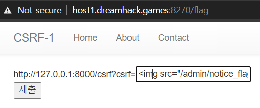

# CSRF-1

	-   /csrf : 쿼리를 받아서 화면에 출력 
	-   /memo : memo_text의 내용을 출력
	-   /admin/notice_flag : memo_text에 flag 추가
	-   /flag : 로컬호스트로 /csrf 요청을 보냄
    

-   flag는 /admin/notice_flag?userid=admin으로  **로컬 127.0.0.1가  요청을  보내면, memo에  추가가  된다.**
-   내가  /admin/notice_flag로  접속하면, 로컬  호스트가  아니라고  에러가  난다.

-   /flag에는 /csrf의  경로의  요청을  로컬로  보낼  수  있는  기능이  있다.

-   /csrf는 받은 쿼리를 출력할때, script, frame, on을  필터링한다.
-   필터링을 피해서 img태그의  src 속성을 이용한다. src에  주소를  넣으면  이미지가  로드되면서  해당  주소로  요청이  간다.  
    

-   다시, /flag  의  기능을  이용해서,

` http://127.0.0.1:8000/csrf?csrf=`
- 저렇게  넣고 제출.
- 작성한 URL query string을 포함하여, /csrf 페이지속 img가 로드되고, 목표한 요청을, 목표한 환경으로 보내는 것에 성공.
- /memo에서 flag를 확인할 수 있다.

 
> CSRF는 다른 유저의 세션, 권한으로만 보낼 수 있는 요청을 하도록 유도하는 방법의 공격기법이다. 
이 문제의 목표는 로컬호스트로 주어진 쿼리의 URL로 요청을 보내는 것으로, 다른 유저의 세션으로 요청을 보내는 것을 비슷하게 구현하였다.