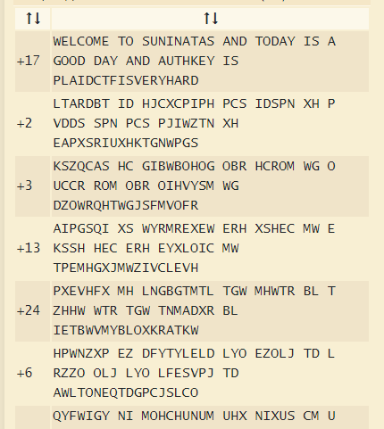

# for-19
    
    Cipher II : What is it?
    
    0100111001010110010000110101010001000110010001000101
    0110001000000100101101000110001000000100101001001100
    0100010101011010010001010101001001001011010100100100
    1010001000000101001001000101010101010010000001001011
    0100011001010101010100100101000000100000010110100100
    1010001000000101001000100000010110000100011001000110
    0101010100100000010101010101001001010000001000000101
    0010010001010101010100100000010100100100110001001011
    0101100101000010010101100101000000100000010110100100
    1010001000000100011101000011010100100101101001010101
    0101010001001011010101110101101001001010010011010101
    0110010010010101000001011001010100100100100101010101

- 처음엔 10진수로 변환을 해야하나?? 싶었지만, 바이너리이다. 시작이 0인 것도 있으니, 그리고 저렇게 큰 숫자일리가 없잖아. 
- 암튼 바이너리를 텍스트로 바꿔준다. 

- `NVCTFDV KF JLEZERKRJ REU KFURP ZJ R XFFU URP REU RLKYBVP ZJ GCRZUTKWZJMVIPYRIU`
- 알고리즘이 적용되어있다. 
- 문자열 알고리즘하면, **Caeser Cipher** 아이가!
- [https://www.dcode.fr/caesar-cipher](https://www.dcode.fr/caesar-cipher) 여기서 디코딩을 한다. 

17칸 미룬게 답이다.

- `WELCOME TO SUNINATAS AND TODAY IS A GOOD DAY AND AUTHKEY IS PLAIDCTFISVERYHARD`