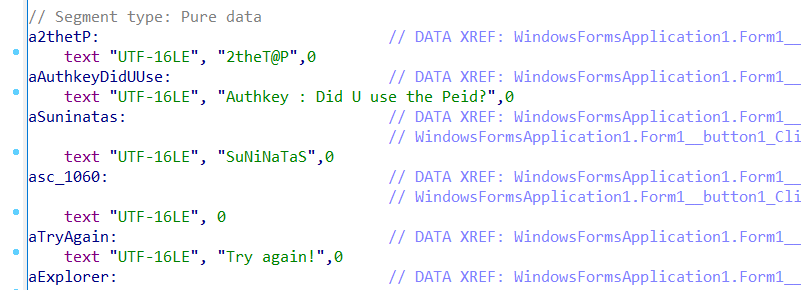

# rev-9

    input을 받는 프로그램.
    아무거나 넣어보니 "Try again!" 이라고만 한다. 

- IDA로 분석

Did U use the peid?

***
> 아직 IDA로 분석한 프로그램의 구조를 잘 파악하질 못하겠다.   
뭐가 어떻게 해서 이게- 이렇게- 저게- 저렇게 되는지..모르겠다.   
근데 뭐  처음이니까, 알리가 없지.   
지금까지 푼 3문제 모두 이런 식으로 바이너리에 대놓고 flag가 있었다.   
근데 이렇게 대놓고 보여주는 형태가 아니면 어떻게 꼬아서 문제를 만들어내는 건지 모르겠네..   
빨리 실력키워서 어려운 문제도 보고 싶다.    
