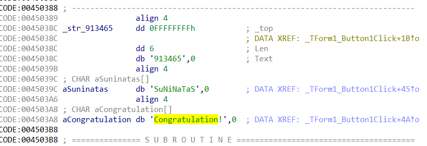

# rev-9

    파일을 다운받고, 열어보면 인풋을 입력하는 프로그램이 실행된다. 
    아무 문자나 넣어봐도 응답이 없다. 

- ida에 넣어서 분석을 해본다. 
- 코드 양이 너무 많다... search로 push값을 찾아본다.
- 또는 그래프를 본다. 

913465

- contraturation이 있는 부분의 코드에 str에 대한 조건이 있다. 
- 해당 숫자를 입력하면 프로그램에 contraturation이 뜬다. 이게 키이다.   

***
>리버싱 문제는 처음이다. 오늘은 도서관에서 관련 책도 빌려왔다.   
천천히 공부해볼 예정이다.