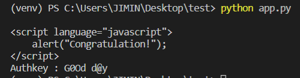

# web-7

    아이유 사진이 있고.. 한참 내리면 버튼 하나가 있네?
    눌러본다. "Fail too slow" 너무 느려서 실패?
    소스를 본다. Hint는 "Faster and Faster" 
    버튼을 빨리 누르라는 뜻인듯.

- 페이지가 로드되면 스크롤 쫙- 내려서 바로 버튼 누르면- 될리가 없다. 
- 기계의 도움이 필요하다...

***
### 작성한 코드
    import requests
    from bs4 import BeautifulSoup

    url1='http://suninatas.com/challenge/web07/web07.asp'
    url2='http://suninatas.com/challenge/web07/web07_1.asp'

    with requests.Session() as s:
        s.get(url1)
        res = s.post(url2).text

        soup = BeautifulSoup(res, 'html.parser')
        print(soup)

- url1로 첫페이지를 `GET`
- url2로 버튼클릭 `POST`
- 그리고 내용 확인을 위해서 수프로 확인
***

요로코롬 key가 나온다.

>사진이 로드되는데 걸리는 시간+사람의 느린 손 이라는 한계를 넘기위해 HTTP요청을 스크립트로 보내게 끔 유도하고 있다.    
이 문제는 그런 요청을 보내는 스크립트의 작성능력을 테스트하는 문제이다. 