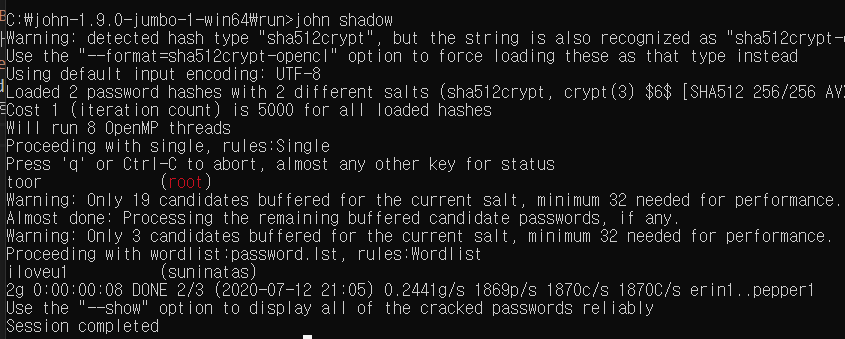

<!-- ---
layout: default
title: suninatas
nav_order: 1
--- -->

# Forensics-14

    리눅스에는 /etc/passwd, etc/shadow가 있다. 
    /etc/passwd에 사용자 계정 정보가 들어있다.

- `root:x:0:0:root:/root:/bin/bash` 
- root:`x` 여기서 x부분이 패스워드인데, 암호화되어 shadow에 저장되어있다. 

- `/etc/shadow`
- `root:$6$E2loH6yC$0lcZ0hG/b.YqlsPhawt5NtX2jJkSFBK6eaF/wa46d8/3KPs6d45jNHgNoJOl7X1RsOrYsZ.J/BBexJ93ECVfW.:15426:0:99999:7:::`
- 여기서 $로 시작해서 15426 앞까지가 암호화된 패스워드이다. 
- 이걸 크랙하기 위해서 `john the ripper`라는 툴을 이용한다. 
- 프로그램을 설치하고, run에 cmd.exe를 넣고, shadow파일도 run에 넣어준다음에 `john shadow`를 입력하면 비번을 알려준다. 

suninatas비번은 iloveu1

>리눅스의 디렉토리 구조나 사용자 정보 파일도 처음 알았다. john the ripper 같은 툴도 처음 사용해봤다. 리눅스를 써봐야 좀 익숙해질텐데.. 노트북 하나 더 사고 싶다.