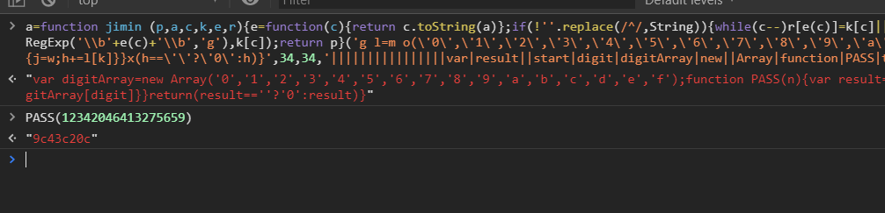

# web-5

    

이런 난독화된 script가 삽입되어 있다.   
check key value라고, input을 받고 있고, 아무런 값도 안 준다.    힌트는 `<!--Hint : 12342046413275659 -->`  
저 스크립트를 해석하는게 핵심일 듯.

- 자바스크립트 난독화는 말 그대로 사람이 보기 힘들게 코드를 꼬는 것이다. 난 봐도 모르겠지만, 컴퓨터는 이해를 잘 할테니.. 자바스크립트를 잘 아는 콘솔에 저 함수를 넣어본다. 
- 잘보면 `eval()`로 함수를 감싸고 있다. 그래서 그걸 풀고, `a=function...` 이렇게 넣어본다. 
- 그럼 문장이 하나 튀어나온다. 
- 보면 `PASS` 라는 이름의 함수가 있다.
- 숫자를 받는 함수이고, 여기에 힌트를 넣어야한다는 것을 본능적으로 느낄 수 있다.
- `PASS(12342046413275659)`
- `9c43c20c`
- 이걸 인풋에 넣으면 키가 나온다. 

이렇게 할거 없이 eval(p,a,c,k,e,r)를 검색하면 언팩킹 사이트가 나온다.

> 자바스크립트 난독화를 실제로 보는 건 처음이라 처음엔 감을 못 잡았다. 그래도 콘솔로 접근해서 함수를 해석하게 하는 것은 좋은 방법이있다.