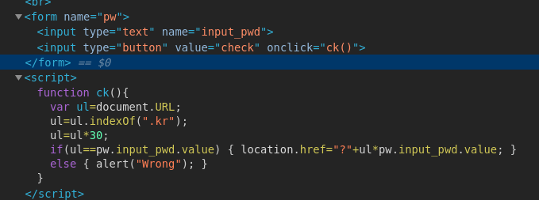
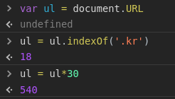

# input-to-js

    인풋을 받는데가 있고, 아무 값이나 넣어서 제출하면 wrong!이 뜬다. 

    개발자도구로 요소를 보니, 인풋값을 받는 <script>가 있다. 

URL에서 kr의 인덱스값에 30을 곱한값을 넣으면 해결된다는 것을 알 수 있다.    
콘솔에 입력해서 해당 값을 구해본다.

 

540을 넣으면 해결된다. 

>자바스크립트를 해석할 수 있는지를 묻는 문제이다.    