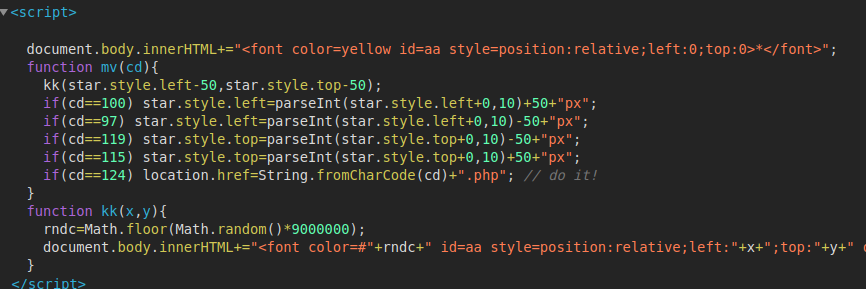

# ascii-js

    
    cd==100
    cd==97
    이런건 보자마자 '아스키'라는 것을 간파해야한다.
    대충 10~100번대 숫자들이면 아스키임. 

    따라서 표를 참고해서보면 위에서부터 
    d
    a
    w
    s
    |
    위에 4개는 별을 움직이는거(의미없음)
    //do it
    이라고 친절하게 설명되어있는 '|' 기호를 입력하면,
    해결된다. 

> 자바스크립트를 읽을 줄 알아야함.    
그리고, 아스키임을 파악하는 능력도 필요.   
스크립트 파일에 모든 단서가 있지는 않음. 어느정도 감이 필요함.
    