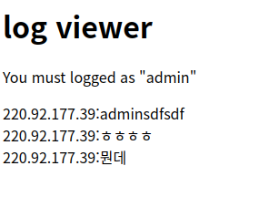
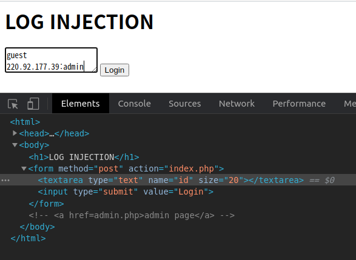

# 38- log injection

인풋을 받는다. 
admin.php를 방문해보니, 인풋값에 대한 로그가 남아있다. 



여기에 `ip: admin`을 남기는 것이 목표.   
하지만, admin문자는 필터링되어 바로 쓸 수 없다.

\r\n injection방법을 이용한다. 
예를 들어, 
```
guest\r\n220.92.177.39:admin
```
를 입력하면, `\r\n` 개행문자에 의해, 다음과 같이 로그가 기록된다. 
```
220.92.177.39:guest
220.92.177.39:admin
```
저 문자를 그대로 넣으면 인식을 못하기에,   
직접 한 칸을 띄워서 넣어준다. 

이때, **input은 개행이 없는 한 줄의 인풋만 받는다.**   
그래서 여러 줄을 넣을 수 있는 `textarea`로 바꿔준다. 
> html 요소를 변경시켜 기존 태그의 한계를 넘은 값을 넣을 수 있다. 



그럼 admin으로 로그를 남길 수 있다. 

> CRLF injection은 개행문자를 삽입하여 줄을 나누는 공격이다.    
문제처럼 인풋값을 남기는 로그내용 등을 조작할 수 있다.   

> 이밖에도 기존태그에서는 삽입이 불가능한 형식의 값을, 태그를 변경하여 삽입할 수도 있다.   
client side의 방어는 유저가 조작이 가능하기에 전혀 기능을 하지 못한다.

