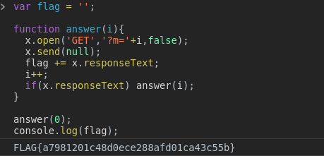

# HTML에 포함된 기존 자바스크립트를 바꾸는 문제

```html
<script>
...

x=run();
function answer(i){
  x.open('GET','?m='+i,false);
  x.send(null);
  aview.innerHTML=x.responseText;
  i++;
  if(x.responseText) setTimeout("answer("+i+")",20);
  if(x.responseText=="") aview.innerHTML="?";
}
setTimeout("answer(0)",1000);
</script>
```
이런 스크립트가 있다.   
그래서 처음 들어가면 저 함수가 동작하면서 responseText를 빠르게 하나씩 보여준다.   
읽을 수가 없다.    

함수를 분석해보면, ?m= 에 i를 붙여가면서 응답을 한글자씩 받아서 값으로 띄우고 있다.

응답받은 내용이 저장되도록 하면 해결이 된다.

```javascript
var flag = '';

function answer(i){
  x.open('GET','?m='+i,false);
  x.send(null);
  flag += x.responseText;
  i++;
  if(x.responseText) answer(i);
}

answer(0);
console.log(flag);
```


> 요소검사로 볼 수 있는 자바스크립트 함수를 변경해서 결과를 조작하는 방법을 배울 수 있었다. 
